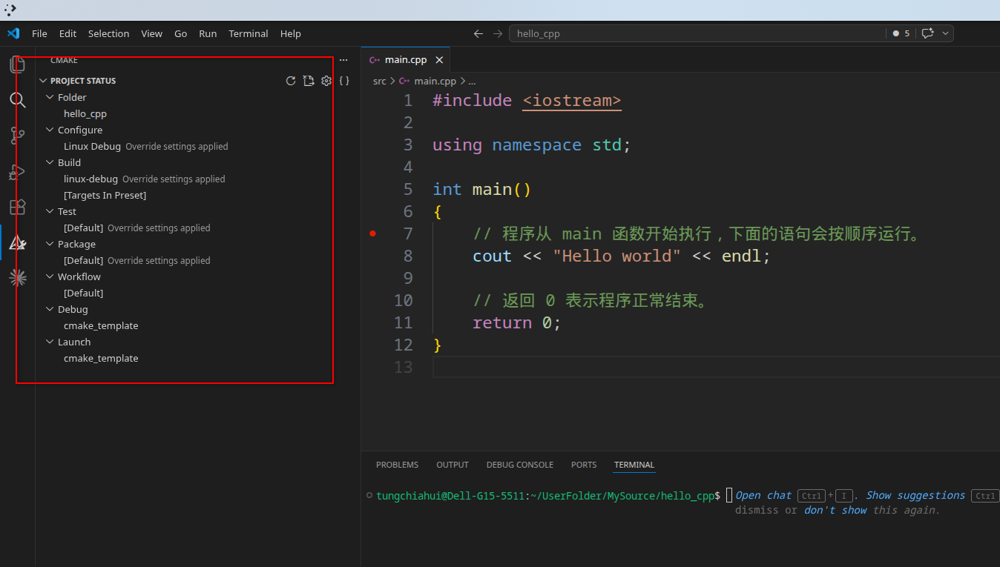
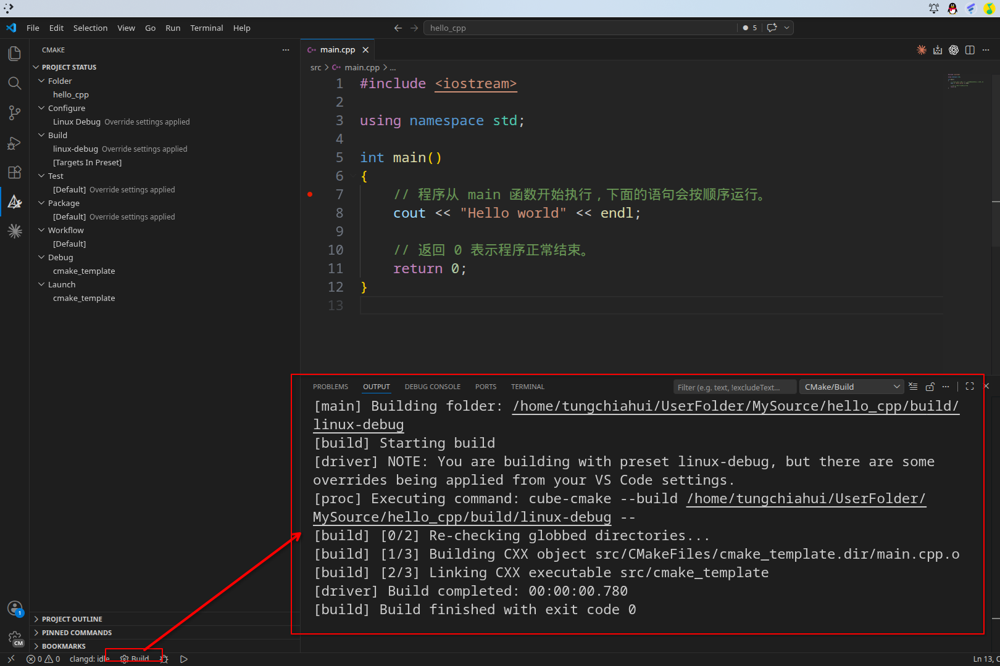
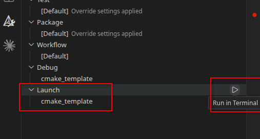
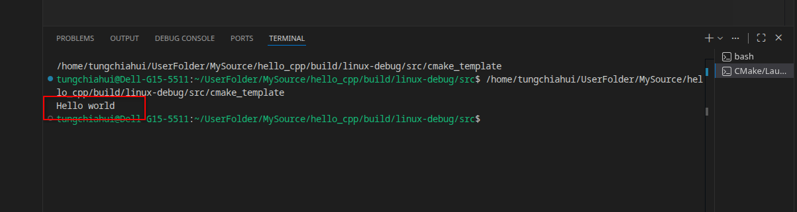

## C++初识

### 本章运行约定

本章的代码示例默认在 `ch1-C++开发环境与第一个工程` 下载并跑通的 CMake 模板中运行。

从这一章开始，前期语法练习只改这个文件：

```text
src/main.cpp
```

每个示例都可以把代码复制到 `src/main.cpp` 中，然后重新构建并运行模板程序。

暂时不要修改这些文件和目录：

1. `CMakeLists.txt`
2. `src/CMakeLists.txt`
3. `src/lib1/`
4. `src/lib2/`

也不用手动写 `g++ main.cpp`。我们继续用上一章已经跑通的 CMake 模板来编译程序。

常用命令：

```bash
cmake --build --preset linux-debug
./build/linux-debug/src/cmake_template
```

如果你还没有完成上一章的工程环境搭建，请先看从 [C++开发环境与第一个工程](/wiki/2023-10-05-cplusplus-jiao-xue/ch1-c-kai-fa-huan-jing-yu-di-yi-ge-gong-cheng) 开始，本教程一直使用同一个 CMake 模板。写到这里时，你的工程大致还是这个结构.

### 第一个C++程序

打开工程中的：

```text
src/main.cpp
```

把内容替换为：

```cpp
#include <iostream>

using namespace std;

int main()
{
    // 程序从 main 函数开始执行，下面的语句会按顺序运行。
	cout << "Hello world" << endl;

	// 返回 0 表示程序正常结束。
	return 0;
}
```

**运行/观察结果：** 运行后会按输出语句打印对应内容，变量值可结合初始化、赋值和函数调用顺序推导。

#### 构建并运行程序

在工程根目录执行：(或者直接用上一节讲的图形化界面编译,下面也会再教你一下)

```bash
cmake --build --preset linux-debug
./build/linux-debug/src/cmake_template
```

图形化步骤:

配置成build+debug模式:



点击左下角的build.



运行





终端输出：

```text
Hello world
```

### main函数参数

`main` 函数不是必须带参数。最常见的两种写法是：

```cpp
int main()
{
	// 程序从 main 函数开始执行，下面的语句会按顺序运行。
	// 返回 0 表示程序正常结束。
	return 0;
}
```

**运行/观察结果：** 这是最简洁的程序入口，适合不需要读取命令行参数的程序。

```cpp
int main(int argc, char* argv[])
{
	// 程序从 main 函数开始执行，argc/argv 用来接收命令行参数。
	// 返回 0 表示程序正常结束。
	return 0;
}
```

**运行/观察结果：** 这也是标准的程序入口写法，适合需要读取命令行参数的程序。

其中：

* `argc` 表示命令行参数的数量，通常至少为 1，因为程序自身的路径也会算作一个参数。
* `argv` 表示命令行参数数组，`argv[0]` 通常是程序自身的路径或名称，`argv[1]` 开始才是用户传入的参数。
* `char* argv[]` 也可以写成 `char** argv`，两者在这里表达的含义相同。

示例：

```cpp
#include <iostream>

using namespace std;

int main(int argc, char* argv[])
{
    // 程序从 main 函数开始执行，argc/argv 用来接收命令行参数。

	cout << "argc = " << argc << endl;

	for (int i = 0; i < argc; i++) {
		cout << "argv[" << i << "] = " << argv[i] << endl;
	}

	// 返回 0 表示程序正常结束。
	return 0;
}
```

**运行结果**：见下方“运行结果”；`argv[0]` 会随启动方式不同而变化，重点观察 `argc` 和各个 `argv` 的对应关系。

构建并传入命令行参数运行：

```bash
cmake --build --preset linux-debug
./build/linux-debug/src/cmake_template hello 123
```

**运行结果**：

```text
argc = 3
argv[0] = ./build/linux-debug/src/cmake_template
argv[1] = hello
argv[2] = 123
```

> 注意：`argv[0]` 的具体内容和启动方式有关，可能是 `./build/linux-debug/src/cmake_template`，也可能是完整路径。实际处理参数时，通常从 `argv[1]` 开始读取用户输入的内容。

### 注释

**作用**：在代码中加一些说明和解释，方便自己或其他程序员程序员阅读代码

**两种格式**

1. **单行注释**：`// 描述信息` 
   - 通常放在一行代码的上方，或者一条语句的末尾，==对该行代码说明==
2. **多行注释**： `/* 描述信息 */`
   - 通常放在一段代码的上方，==对该段代码做整体说明==

> 提示：编译器在编译代码时，会忽略注释的内容

### 变量

**作用**：给一段指定的内存空间起名，方便操作这段内存

**语法**：`数据类型 变量名 = 初始值;`

**示例：**

```cpp
#include<iostream>
using namespace std;

int main() {

	//变量的定义
	//语法：数据类型  变量名 = 初始值

	int a = 10;

	cout << "a = " << a << endl;
	

	return 0;
}
```

**运行/观察结果：** 运行后会按输出语句打印对应内容，变量值可结合初始化、赋值和函数调用顺序推导。

> 注意：C++在创建变量时，必须给变量一个初始值，否则会报错

### 常量

**作用**：用于记录程序中不可更改的数据

C++定义常量两种方式

1. **\#define** 宏常量： `#define 常量名 常量值`
   * ==通常在文件上方定义==，表示一个常量

2. **const**修饰的变量 `const 数据类型 常量名 = 常量值`
   * ==通常在变量定义前加关键字const==，修饰该变量为常量，不可修改

**示例：**

```cpp
//1、宏常量
#define day 7

int main() {

	cout << "一周里总共有 " << day << " 天" << endl;
	//day = 8;  //报错，宏常量不可以修改

	//2、const修饰变量
	const int month = 12;
	cout << "一年里总共有 " << month << " 个月份" << endl;
	//month = 24; //报错，常量是不可以修改的
	
	

	return 0;
}
```

**运行/观察结果：** 运行后会按输出语句打印对应内容，变量值可结合初始化、赋值和函数调用顺序推导。

### 关键字

**作用：**关键字是C++中预先保留的单词（标识符）

* **在定义变量或者常量时候，不要用关键字**

C++关键字如下：

| asm        | do           | if               | return      | typedef  |
| ---------- | ------------ | ---------------- | ----------- | -------- |
| auto       | double       | inline           | short       | typeid   |
| bool       | dynamic_cast | int              | signed      | typename |
| break      | else         | long             | sizeof      | union    |
| case       | enum         | mutable          | static      | unsigned |
| catch      | explicit     | namespace        | static_cast | using    |
| char       | export       | new              | struct      | virtual  |
| class      | extern       | operator         | switch      | void     |
| const      | false        | private          | template    | volatile |
| const_cast | float        | protected        | this        | wchar_t  |
| continue   | for          | public           | throw       | while    |
| default    | friend       | register         | true        |          |
| delete     | goto         | reinterpret_cast | try         |          |

`提示：在给变量或者常量起名称时候，不要用C++得关键字，否则会产生歧义。`

### 标识符命名规则

**作用**：C++规定给标识符（变量、常量）命名时，有一套自己的规则

* 标识符不能是关键字
* 标识符只能由字母、数字、下划线组成
* 第一个字符必须为字母或下划线
* 标识符中字母区分大小写

> 建议：给标识符命名时，争取做到见名知意的效果，方便自己和他人的阅读

## C 与 C++ 的关系和学习路线

### C 和 C++ 是什么

C 和 C++ 都是通用的编译型程序设计语言。除此之外，常见的编程语言
还有 Python、Rust、Go、C#（读作 C Sharp）、Java 和 JavaScript 等；
Shell 则主要用于编写命令行和系统管理脚本。

C++ 最初由 C 语言发展而来，因此两者在基本语法、运算符、流程控制、
函数和指针等方面有很多相似之处。在一些同时涉及两者的技术资料、工具链
和岗位描述中，人们常用“C/C++”作为合称。

但是，C 和 C++ 现在是两门分别制定标准、分别发展的语言，不能简单理解
为同一门语言的两个版本：

1. C++ 不是“完全兼容 C”。大部分简单的 C 代码可以较容易地迁移到
   C++，但仍有一些合法的 C 代码不能直接作为 C++ 编译。
2. C++ 不只是“带有类的 C”。现代 C++ 还包括模板、RAII、异常、
   Lambda、智能指针、并发支持和丰富的标准库。
3. C 也不是已经被 C++ 淘汰的旧语言。操作系统、嵌入式开发、驱动、
   底层库和跨语言接口中仍然大量使用 C。

因此，C 和 C++ 既有共同基础，也有各自适合的编程方式。学习其中一门
确实能帮助理解另一门，但写 C++ 时不应只是照搬 C 风格的代码。

| 特性 | C 语言 | C++ 语言 |
|:---|:---|:---|
| 语言定位 | 小而精简，强调直接表达底层操作 | 功能更丰富，支持从底层到高层抽象 |
| 编程范式 | 主要采用过程式编程 | 多范式：过程式、面向对象、泛型、函数式等 |
| 资源管理 | 通常手动申请和释放资源 | 支持手动管理，更推荐使用 RAII 和智能指针 |
| 抽象与复用 | 函数、结构体、宏和模块化文件 | 函数、类、模板、泛型算法和标准库 |
| 标准库 | C 标准库 | C++ 标准库，也提供对大部分 C 标准库功能的支持 |
| 类型系统 | 相对简单，部分隐式转换较宽松 | 类型系统更丰富，通常提供更严格的检查 |
| 运行效率 | 适合高性能和底层开发 | 同样适合高性能开发，合理抽象通常不会带来额外开销 |
| 常见场景 | 嵌入式、操作系统、驱动、底层库 | 游戏、图形、机器人、桌面软件、基础设施和高性能计算 |

表格中的应用场景不是硬性边界。例如，嵌入式系统也可以使用 C++，大型
应用也可能包含 C 模块。最终选择哪门语言，要看项目需求、运行环境、
现有生态和团队经验。

### 应该先学 C，还是直接学 C++

学习 C++ 并不要求先完整学完 C。对于本教程的读者，推荐直接按照 C++
路线学习：

1. 先掌握变量、分支、循环、函数、数组和基本输入输出。
2. 再学习引用、指针、结构体、类和对象。
3. 接着学习 `std::string`、`std::vector`、迭代器和常用算法。
4. 然后理解 RAII、智能指针、模板、Lambda 和异常处理。
5. 最后结合 CMake、调试器、单元测试和第三方库完成真实工程。

如果以后需要进行嵌入式、操作系统、驱动或纯 C 项目开发，再系统补充 C
语言中的数组与指针、内存布局、结构体、预处理器和手动资源管理会更有
针对性。

> 本教程以 C++ 为主。遇到与 C 语言共通的语法时会顺带说明，但示例会
> 尽量采用适合现代 C++ 的写法，而不是把 C++ 当作 C 语言的简单扩展。

### 补充学习资料

本教程主要负责梳理知识点、工程环境和实践中容易遇到的问题。初学者也
可以结合以下视频或文档学习：

1. [C++ 视频教程](https://www.bilibili.com/video/BV1et411b73Z)
2. [鹏哥 C 语言视频](https://www.bilibili.com/video/BV1cq4y1U7sg)
3. [菜鸟教程：C 语言教程](https://www.runoob.com/cprogramming/c-tutorial.html)
4. [菜鸟教程：C++ 教程](https://www.runoob.com/cplusplus/cpp-tutorial.html)

不同资料采用的 C++ 标准和代码风格可能不同。学习语法时可以参考多个
来源，但在本教程的工程中，以当前章节给出的 C++ 写法和 CMake 配置为准。
