## 初识OpenCV
### 简介

提及计算机视觉（computer vision），就不得不提起图像处理（image processing）。虽然两者没有明确的界线，但是通常将图像处理理解为计算机视觉的预处理过程。因此，在介绍计算机视觉之前，有必要先介绍图像处理。

图像处理一般指数字图像处理（digital image processing），是通过数学函数和图像变换等手段，对二维数字图像进行分析，从而获得图像数据中的潜在信息。其内容通常包括图像压缩、图像增强与复原，以及匹配、描述和识别三大部分，涵盖了噪声去除、图像分割、特征提取等多种处理方法与技术。

计算机视觉是一门研究如何让机器“看”的科学，即利用计算机来模拟人的视觉机理。它通过摄像头代替人眼，对目标进行识别、跟踪和测量，并通过对视觉数据的处理获取更深层次的信息。例如，通过三维重建技术对环绕建筑物一周的视频进行分析，可以在计算机中重构出建筑物的三维模型；又如，通过安装在车辆上的摄像头拍摄前方场景，可以推断车辆是否能够顺利通过前方区域，从而辅助决策。

对于人类来说，通过视觉获取环境信息是一件非常容易的事情，因此有些人会误认为实现计算机视觉也是一件简单的事情，但事实并非如此。计算机视觉本质上是一个“逆问题”，即通过观测到的信息去恢复被观测物体或环境的信息。在这个过程中往往会丢失部分信息，导致信息不完整，从而增加问题的复杂性。例如，在使用单个摄像头拍摄场景时，由于缺失了距离信息，常常会出现图像中“人比楼房高”的现象。因此，计算机视觉仍然是一项具有挑战性的研究领域，还有很长的发展道路要走。

无论是图像处理还是计算机视觉，本质上都需要在计算机中处理数据。因此，研究人员必须面对一个棘手的问题——如何将研究成果通过代码实现并进行仿真验证。在这一过程中，经常会遇到重复编写基础功能程序的问题，也就是人们常说的“重复造轮子”。

为了给研究人员提供“现成的车轮”，英特尔（Intel）公司提出了开源计算机视觉库（Open Source Computer Vision Library，OpenCV）的概念。该库集成了大量图像处理与计算机视觉领域的通用算法，从而有效避免重复和低效的开发工作，OpenCV 也因此应运而生。

OpenCV 由一系列 C 语言函数和 C++ 类构成。除了支持 C/C++ 开发外，还支持 C#、Ruby 等编程语言，并提供 Python、MATLAB、Java 等语言接口，可运行于 Linux、Windows、macOS、Android 和 iOS 等多种操作系统。OpenCV 的出现极大地优化了计算机视觉算法验证的流程，因此受到了众多研究者的青睐。

经过二十多年的发展，OpenCV 已成为计算机视觉领域最重要的工具之一。

### 参考资料


*视频教学：https://www.bilibili.com/video/BV1jk4y1i7gN*

*图书教学：https://www.epubit.com/bookDetails?id=UB7209964621702*

*参考代码：https://github.com/tungchiahui/OpenCV_Projects*

### 安装OpenCV

详见<NuxtLink to="/wiki/ide-setup#opencv_cuda环境搭建">opencv_cuda环境搭建</NuxtLink>

## 数据载入、显示与保存

要对一张图像进行处理，首先需要获得该图像。在日常生活中，我们可以通过相机、手机等设备获取照片，并以某种格式存储在硬盘中。
同样，在计算机程序中进行图像处理时，也需要通过特定方式获取图像数据，并将其以一定的数据类型存储在相应的容器中，随后再通过某种形式展示给用户。
因此，本章将介绍图像数据的载入、存储与输出，包括图像与视频的读取、图像存储容器的创建与使用，以及将处理后的结果以图像或视频形式进行保存等内容。

### 图像存储容器

与我们日常所看到的图像不同，数字图像在计算机中是以矩阵的形式存储的。矩阵中的每一个元素都用于描述图像中的某种信息，例如亮度、颜色等，如图 2-1 所示。
数字图像处理的本质，就是通过一系列操作，从这些矩阵数据中提取更深层次信息的过程。因此，学习图像处理的第一步，就是掌握如何对这些矩阵数据进行操作。
对于接触过 C++ 编程的读者来说，字符串通常以 string 类型存储，整数以 int 类型存储。同样地，在 OpenCV 中，提供了一个 Mat 类用于存储矩阵数据。
本节将详细介绍 Mat 类的使用方法及其支持的运算，通过学习，可以在程序中灵活地使用 Mat 类型变量。

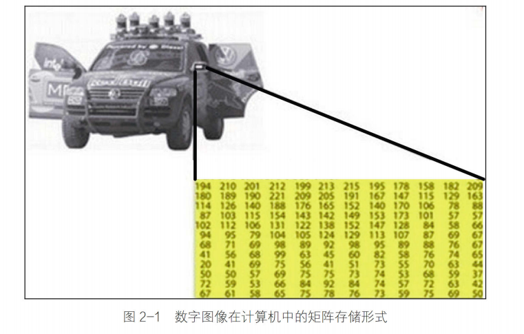

#### Mat 类介绍

在早期的 OpenCV 1.0 版本中，图像是使用名为 IplImage 的 C 语言结构体进行存储的。因此，在一些较老的 OpenCV 教程中，仍然可以看到它的使用。

然而，IplImage 类型存在一个明显的缺点——需要用户手动释放内存。如果程序结束时仍有未释放的 IplImage 变量，就会导致内存泄漏问题。

随着 OpenCV 的不断发展，库中引入了 C++ 接口，并提供了 Mat 类用于数据存储。Mat 类采用自动内存管理机制，有效解决了内存释放问题。当变量不再使用时，其占用的内存会被自动释放。

Mat 类用于保存矩阵类型的数据，包括向量、矩阵，以及灰度图像和彩色图像等。

从结构上看，Mat 类由两部分组成：矩阵头（header）和指向实际数据的指针。矩阵头中包含矩阵的尺寸、存储方式、数据地址以及引用计数等信息。矩阵头的大小是固定的，不会随着矩阵尺寸的变化而改变。

在绝大多数情况下，矩阵头所占空间远小于矩阵数据本身，因此，在图像复制和传递过程中，主要的开销来自于数据部分。

为了解决这一问题，OpenCV 在复制或传递图像时，并不会复制完整的数据，而是仅复制矩阵头以及指向数据的指针。因此，在创建 Mat 对象时，可以先创建矩阵头，再为其赋值数据。其具体方法如代码清单 2-1 所示。

```cpp
cv::Mat a;                      // 创建一个名为 a 的矩阵头
a = cv::imread("test.jpg");    // 读取图像数据，使 a 指向图像像素数据
cv::Mat b = a;                 // 复制矩阵头，并命名为 b
```

上述代码首先创建了一个名为 a 的矩阵头，随后读取一张图像，并使 a 中的矩阵指针指向该图像的像素数据。最后，将 a 的矩阵头复制给 b。
需要注意的是，虽然 a 和 b 各自拥有独立的矩阵头，但它们的矩阵指针指向的是同一块数据。因此，通过任意一个矩阵头对数据进行修改，另一个矩阵头所访问的数据也会随之改变。
此外，当删除变量 a 时，b 并不会变成空数据；只有当 a 和 b 都被释放后，底层的矩阵数据才会真正被释放。
这是因为在矩阵头中维护了一个引用计数（reference count），用于记录当前有多少个对象共享同一块数据。只有当引用计数减为 0 时，该数据才会被释放。

tips:采用引用次数来释放存储内容是 C++中常见的方式，用这种方式可以避免仍有某个变量引用数据时将这个数据删除造成程序崩溃的问题，同时极大地缩减程序运行时所占用的内存。

接下来讲解 Mat 类里可以存储的数据类型。根据官方给出的 Mat 类继承关系图，如图 2-2 所示，我们发现 Mat 类可以存储的数据类型包含 double、float、uchar、unsigned char, 以及自定义的模板等。

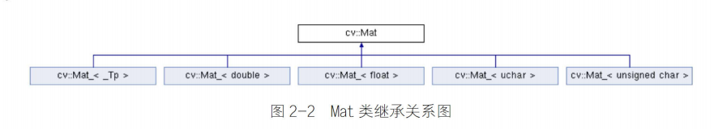

我们可以通过代码清单 2-2 的方式声明一个存放指定类型的 Mat 类变量。

```cpp
cv::Mat A = cv::Mat_<double>(3, 3);  // 创建一个 3×3 的 double 类型矩阵
```

由于 OpenCV 中的 Mat 类主要用于存储图像数据，而像素值的范围直接影响图像的质量。如果使用 8 位无符号整数去存储 16 位图像数据，就会导致严重的颜色失真，甚至产生数据错误。

此外，不同位数的编译器对数据类型长度的定义可能存在差异。为了避免在不同平台或环境下，由于变量位数不一致而导致程序运行出现问题，OpenCV 对数据类型进行了统一规范。

因此，OpenCV 根据数值变量的存储位数，定义了一套专用的数据类型体系。表 2-1 列出了 OpenCV 中常用的数据类型及其取值范围。

| 数据类型   | 具体类型      | 取值范围                       |
| ------ | --------- | -------------------------- |
| CV_8U  | 8 位无符号整数  | 0 ～ 255                    |
| CV_8S  | 8 位有符号整数  | -128 ～ 127                 |
| CV_16U | 16 位无符号整数 | 0 ～ 65535                  |
| CV_16S | 16 位有符号整数 | -32768 ～ 32767             |
| CV_32S | 32 位有符号整数 | -2147483648 ～ 2147483647   |
| CV_32F | 32 位浮点数   | -FLT_MAX ～ FLT_MAX，INF，NaN |
| CV_64F | 64 位浮点数   | -DBL_MAX ～ DBL_MAX，INF，NaN |

仅有数据类型还不足以完整描述图像数据，还需要定义图像的通道（Channel）数量。例如，灰度图像是单通道数据，而彩色图像通常是 3 通道（RGB）或 4 通道（如 RGBA）数据。

针对这一需求，OpenCV 定义了通道数标识：C1、C2、C3、C4，分别表示单通道、双通道、三通道和四通道。
由于每种数据类型都可能对应不同的通道数，因此，OpenCV 将“数据类型”和“通道数”结合起来，用于完整描述图像数据类型。例如：
CV_8UC1：表示 8 位无符号、单通道数据，通常用于灰度图像
CV_8UC3：表示 8 位无符号、三通道数据，通常用于彩色图像
我们可以通过代码清单 2-3 的方式，创建指定数据类型和通道数的 Mat 对象。

```cpp
cv::Mat a(640, 480, CV_8UC3);  // 创建一个 640×480 的 3 通道矩阵（用于彩色图像）

cv::Mat b(3, 3, CV_8UC1);      // 创建一个 3×3 的 8 位无符号单通道矩阵

cv::Mat c(3, 3, CV_8U);        // 创建单通道矩阵，C1 标识可以省略
```

虽然在 64 位编译器中，uchar 和 CV_8U 都表示 8 位无符号整数，但两者有严格的区分：CV_8U 只能用于 Mat 类内部的数据类型标识。如果使用` Mat_<CV_8U>(3,3)` 或 `Mat a(3,3,uchar)`，都会提示创建错误。

#### Mat 类构造与赋值

前一小节已经介绍了 3 种构造 Mat 类变量的方法，但是后两种没有给变量初始化赋值，本小将重点介绍如何灵活地构造并赋值 Mat 类变量。根据 OpenCV 的源码定义，关于 Mat 类的构造方式共有 20 余种，然而，在平时一些简单的应用程序中，很多复杂的构造方式并没有太多的用武之地，因此本书重点讲解作者在学习和做项目中常用的构造与赋值方式。

*1. Mat 类的构造*
(1) 利用默认构造函数（见代码清单2-4）

```cpp
cv::Mat::Mat();
```

通过代码清单2-4，利用默认构造函数构造了一个Mat类，这种构造方式不需要输入任何的参数，在后续给变量赋值的时候会自动判断矩阵的类型与大小，实现灵活的存储，常用于存储读取的图像数据和某个函数运算的输出结果。

(2) 根据输入矩阵尺寸和类型构造（见代码清单2-5）

```cpp
cv::Mat::Mat(int rows,
             int cols,
             int type);
```
- rows: 构造矩阵的行数。
- cols: 矩阵的列数。
- type: 除CV_8UC1、CV_64FC4等从1到4通道以外，还提供了更多通道的参数，通过CV_8UC(n)中的n来构建多通道矩阵，其中n最大可以取到512。

这种构造方法我们在前文中也见过，通过输入矩阵的行、列，以及存储数据类型，实现构造。这种定义方式清晰、直观，易于阅读，常用在明确需要存储数据尺寸和数据类型的情况下，例如相机的内参矩阵、物体的旋转矩阵等。
利用输入矩阵尺寸和数据类型构造Mat类的方法存在一种变形，通过将行和列组成一个Size()结构进行赋值，代码清单2-6中给出了这种构造方法的原型。

代码清单2-6 用Size()结构构造Mat类

```cpp
cv::Mat::Mat(Size size(),
             int type);
```

- size: 二维数组变量尺寸，通过Size(cols,rows)进行赋值。
- type: 与代码清单2-5中的参数一致。

利用这种方式构造Mat类时要格外注意，在Size()结构里，矩阵的行和列的顺序与代码清单2-5中的方法相反，使用Size()时（见代码清单2-7），列在前、行在后。如果不注意，虽然同样会构造成功Mat类，但是当我们需要查看某个元素时，我们并不知道行与列颠倒，就可能会出现数组越界的错误。

代码清单2-7 用Size结构构造Mat示例

```cpp
cv::Mat a(Size(480, 640), CV_8UC1);   // 构造一个行为640、列为480的单通道矩阵
cv::Mat b(Size(480, 640), CV_32FC3); // 构造一个行为640、列为480的3通道矩阵
```

(3) 利用已有矩阵构造（见代码清单2-8）

```cpp
cv::Mat::Mat(const Mat &m);
```
- m: 已经构建完成的Mat类矩阵数据。

这种构造方式非常简单，可以构造出与已有Mat类变量存储内容一样的变量。注意，这种构造方式只是复制了Mat类的矩阵头，矩阵指针指向的是同一个地址，因此，如果通过某一个Mat类变量修改了矩阵中的数据，那么另一个变量中的数据也会发生改变。

提示：如果希望复制两个一模一样的Mat类而彼此之间不会受影响，那么可以使用clone()函数。

如果需要构造的矩阵尺寸比已有矩阵小，并且存储的是已有矩阵的子内容，那么可以用代码清单2-9中的方法进行构建。

代码清单2-9 构造已有Mat类的子类

```cpp
cv::Mat::Mat(const Mat &m,
             const Range &rowRange,
             const Range &colRange = Range::all());
```

- m: 已经构建完成的Mat类矩阵数据。
- rowRange: 在已有矩阵中需要截取的行数范围，是一个Range变量，例如从第2行到第5行可以表示为Range(2,5)。
- colRange: 在已有矩阵中需要截取的列数范围，是一个Range变量，例如从第2列到第5列可以表示为Range(2,5)，当不输入任何值时，表示所有列都会被截取。

这种方式主要用于在原图中截图使用。不过需要注意的是，通过这种方式构造的Mat类与已有Mat类享有共同的数据，即如果两个Mat类中有一个数据发生更改，那么另一个也会随之更改。

代码清单2-10 在原Mat中截取子Mat类

```cpp
cv::Mat b(a, Range(2, 5), Range(2, 5));  // 从a中截取部分数据构造b
cv::Mat c(a, Range(2, 5));               // 默认最后一个参数构造c
```

*2. Mat类的赋值*
构建完成Mat类后，变量里并没有数据，需要将数据赋值给它。针对不同情况，OpenCV 4.1提供了多种赋值方式，下面介绍如何给Mat类变量赋值。

(1) 构造时赋值（见代码清单2-11）
```cpp
cv::Mat::Mat(int rows,
             int cols,
             int type,
             const Scalar &s);
```

- rows: 矩阵的行数。
- cols: 矩阵的列数。
- type: 存储数据的类型。
- s: 给矩阵中每个像素赋值的参数变量，例如Scalar(0,0,255)。

该种方式是在构造的同时进行赋值（见代码清单2-12），将每个元素要赋予的值放入Scalar结构中即可。这里需要注意的是，用此方法会将图像中的每个元素赋予相同的数值，例如Scalar(0,0,255)会将每个像素的3个通道值分别赋为0、0、255。

代码清单2-12 在构造时赋值示例

```cpp
cv::Mat a(2, 2, CV_8UC3, cv::Scalar(0, 0, 255));  // 创建一个3通道矩阵，每个像素都是0,0,255
cv::Mat b(2, 2, CV_8UC2, cv::Scalar(0, 255));     // 创建一个2通道矩阵，每个像素都是0,255
cv::Mat c(2, 2, CV_8UC1, cv::Scalar(255));         // 创建一个单通道矩阵，每个像素都是255
```

我们在程序return语句之前加上断点进行调试，用Image Watch查看每一个Mat类变量里的数据，结果如图2-3所示，证明已成功构造矩阵并赋值。

提示：Scalar结构中变量的个数一定要与定义中的通道数相对应。如果Scalar结构中变量的个数大于通道数，则位置在大于通道数之后的数值将不会被读取，例如执行a(2,2,CV_8UC2,Scalar(0,0,255))后，每个像素值都将是(0,0)，而255不会被读取；如果Scalar结构中变量的个数小于通道数，则会以0补充。

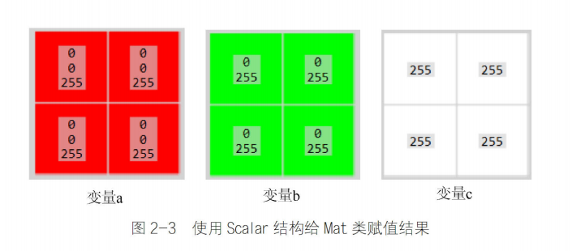

(2) 枚举法赋值

这种赋值方式是将矩阵中所有的元素一一列举，并用数据流的形式赋值给Mat类。具体赋值形式如代码清单2-13所示。

代码清单2-13 利用枚举法赋值示例

```cpp
cv::Mat a = (cv::Mat_<int>(3, 3) << 1, 2, 3, 4, 5, 6, 7, 8, 9);
cv::Mat b = (cv::Mat_<double>(2, 3) << 1.0, 2.1, 3.2, 4.0, 5.1, 6.2);
```

上面第一行代码创建了一个3×3的矩阵，矩阵中存放的是1～9的9个整数，先将矩阵中的第一行存满，之后再存入第二行、第三行，即1、2、3存放在矩阵a的第一行，4、5、6存放在矩阵a的第二行，7、8、9存放在矩阵a的第三行。第二行代码创建了一个2×3的矩阵，其存放方式与矩阵a相同。


提示：在采用枚举法时，输入的数据个数一定要与矩阵元素个数相同，例如，在代码清单2-13中第一行代码只输入1～8共8个数时，赋值过程会出现报错，因此本方法常用在矩阵数据比较少的情况下。

(3) 循环法赋值

与通过枚举法赋值方法相似，循环法赋值也是对矩阵中的每一个元素进行赋值，但是可以不在声明变量的时候进行赋值，而且可以对矩阵中的任意部分进行赋值。具体赋值形式如代码清单2-14所示。

代码清单2-14 利用循环法赋值示例

```cpp

cv::Mat c = cv::Mat(3, 3, CV_8UC1);  // 定义一个3*3的矩阵
for (int i = 0; i < c.rows; i++)    // 矩阵行数循环
{
    for (int j = 0; j < c.cols; j++)  // 矩阵列数循环
    {
        c.at<uchar>(i, j) = i + j;
    }
}

```

上面代码同样创建了一个3×3的矩阵，通过for循环的方式，对矩阵中的每一个元素进行赋值。需要注意的是，在给矩阵每个元素赋值的时候，赋值函数中声明的变量类型要与矩阵定义时的变量类型相同，即代码清单2-14中第1行和第6行中变量类型要相同，如果第6行代码改成`c.at<double>`程序就会报错，无法赋值。

(4) 类方法赋值

在Mat类里，提供了可以快速赋值的方法，可以初始化指定的矩阵。例如，生成单位矩阵、对角矩阵、所有元素都为0或者1的矩阵等。具体使用方法如代码清单2-15所示。

代码清单2-15 利用类方法赋值示例

```cpp
cv::Mat a = cv::Mat::eye(3, 3, CV_8UC1);
cv::Mat b = (cv::Mat_<int>(1, 3) << 1, 2, 3);
cv::Mat c = cv::Mat::diag(b);
cv::Mat d = cv::Mat::ones(3, 3, CV_8UC1);
cv::Mat e = cv::Mat::zeros(4, 2, CV_8UC3);
```

上面代码中的每个函数的作用及参数的含义介绍如下：
- eye(): 构建一个单位矩阵，前两个参数为矩阵的行数和列数，第三个参数为矩阵存放的数据类型与通道数。如果行和列不相等，则在矩阵的(1,1)、(2,2)、(3,3)等主对角位置处为1。
- diag(): 构建对角矩阵，其参数必须是Mat类型的一维变量，用来存放对角元素的数值。
- ones(): 构建一个全为1的矩阵，参数含义与eye()相同。
- zeros(): 构建一个全为0的矩阵，参数含义与eye()相同。

(5) 利用数组进行赋值

这种方法与枚举法类似，但是该方法可以根据需求改变Mat类矩阵的通道数，可以看作枚举法的拓展，在代码清单2-16中给出了这种方法的赋值形式。

代码清单2-16 利用数组进行赋值示例

```cpp
float a[8] = {5, 6, 7, 8, 1, 2, 3, 4};
cv::Mat b = cv::Mat(2, 2, CV_32FC2, a);
cv::Mat c = cv::Mat(2, 4, CV_32FC1, a);
```

这种赋值方式首先将需要存入Mat类中的变量存入一个数组中，之后通过设置Mat类矩阵的尺寸和通道数将数组变量拆分成矩阵，这种拆分方式可以自由定义矩阵的通道数。当矩阵中的元素数目大于数组中的数据时，将用1.0737418e+08填充赋值给矩阵；当矩阵中元素的数目小于数组中的数据时，将矩阵赋值完成后，数组中剩余数据将不再赋值。由数组赋值给矩阵的过程是首先将矩阵中第一个元素的所有通道依次赋值，之后再赋值下一个元素。为了更好地体会这个过程，我们将定义的b和c矩阵在图2-4中给出。

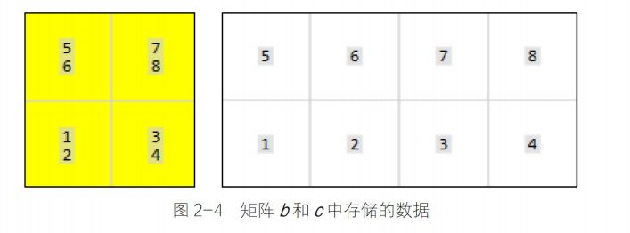


#### Mat类支持的运算

在处理数据时，需要对数据进行加减乘除运算，例如对图像进行滤波、增强等操作都需要对像素级别进行加减乘除运算。为了方便运算，Mat类变量支持矩阵的加减乘除运算，即我们在使用Mat类变量时，将其看作普通的矩阵即可，例如Mat类变量与常数相乘遵循矩阵与常数相乘的运算法则。Mat类与常数运算时，可以直接通过加减乘除符号实现。代码清单2-17中给出了Mat类变量与常数进行加减乘除运算的示例程序。

代码清单2-17 Mat类的加减乘除运算

```cpp
cv::Mat a = (cv::Mat_<int>(3, 3) << 1, 2, 3, 4, 5, 6, 7, 8, 9);
cv::Mat b = (cv::Mat_<int>(3, 3) << 1, 2, 3, 4, 5, 6, 7, 8, 9);
cv::Mat c = (cv::Mat_<double>(3, 3) << 1.0, 2.1, 3.2, 4.0, 5.1, 6.2, 2, 2, 2);
cv::Mat d = (cv::Mat_<double>(3, 3) << 1.0, 2.1, 3.2, 4.0, 5.1, 6.2, 2, 2, 2);
cv::Mat e, f, g, h, i;
e = a + b;
f = c - d;
g = 2 * a;
h = d / 2.0;
i = a - 1;
```

这里需要注意的是，当两个Mat类变量进行加减运算时，必须保证两个矩阵中的数据类型是相同的，即两个分别保存int和double数据类型的Mat类变量不能进行加减运算。与常规的乘除法不同之处在于，常数与Mat类变量运算结果的数据类型保留Mat类变量的数据类型，例如，double类型的常数与int类型的Mat类变量运算，最后结果仍然为int类型。在代码清单2-17的最后一行代码中，Mat类变量减去一个常数，表示的含义是Mat类变量中的每一个元素都要减去这个常数。

在对图像进行卷积运算时，需要两个矩阵进行乘法运算，OpenCV不但提供了两个Mat类矩阵的乘法运算，而且定义了两个矩阵的内积和对应位的乘法运算。代码清单2-18中给出了两个Mat类矩阵的乘法的代码实现。

代码清单2-18 两个Mat类矩阵的乘法运算

```cpp
cv::Mat j, m;
double k;
j = c * d;  //乘法
k = a.dot(b);  //内积
m = a.mul(b);   //对位乘法
```

代码清单2-18中矩阵定义和赋值与代码清单2-17中相同。在代码中定义了两个Mat类变量和一个double变量，分别实现了两个Mat类矩阵的乘法、内积和对应位乘法。

第3行代码的""运算符表示两个矩阵的数学乘积，例如存在两个矩阵A₃ₓ₃和B₃ₓ₃，""运算结果为矩阵C₃ₓ₃，C₃ₓ₃中的每一个元素表示为：
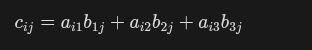

需要注意的是，"*"运算要求第一个Mat类矩阵的列数必须与第二个Mat类矩阵的行数相同，而且该运算要求Mat类中的数据类型必须是CV_32FC1、CV_64FC1、CV_32FC2、CV_64FC2这4种中的一种，也就是对于一个二维的Mat类矩阵，其保存的数据类型必须是float类型或者double类型。
代码清单2-18中的第4行代码表示两个Mat类矩阵的内积。根据输出结果可以知道dot()方法结果是一个double类型的变量，该运算的目的是求取一个行向量和一个列向量点乘，例如存在两个向量d = [d₁ d₂ d₃]和e = [e₁ e₂ e₃]，经过dot()方法运算的结果为：

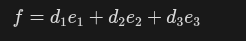

需要注意的是，输入的两个Mat类矩阵必须具有相同的元素数目，但是无论输入的两个Mat类矩阵的维数是多少，都会将两个Mat类矩阵扩展成一个行向量和一个列向量，因此dot()运算的结果永远是一个double类型的变量。

代码清单2-18中的第5行代码表示两个Mat类矩阵对应位的乘积。根据输出结果可以知道mul()方法运算结果同样是一个Mat类矩阵。对于两个矩阵A₃ₓ₃和B₃ₓ₃，经过mul()方法运算的结果C₃ₓ₃中每一个元素都可以表示为：
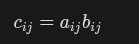

需要注意的是，不同于前两种乘法运算，参与mul()方法运算的两个Mat类矩阵中保存的数据在保证相同的前提下，可以是任何一种类型，并且默认的输出数据类型与两个Mat类矩阵保持一致。在图像处理领域，常用的数据类型是CV_8U，其范围是0～255，当两个比较大的整数相乘时，就会产生结果溢出的现象，输出结果为255，因此，在使用mul()方法时，需要防止出现数据溢出的问题。

#### Mat类元素的读取

对于Mat类矩阵的读取与更改，我们已经在矩阵的循环赋值中介绍过如何用at方法对矩阵的每一位进行赋值，这只是OpenCV提供的多种读取矩阵元素方式中的一种，本小节将详细介绍如何读取Mat类矩阵中的元素，并对其数值进行修改。

在学习如何读取Mat类矩阵元素之前，首先需要知道Mat类变量在计算机中是如何存储的。多通道的Mat类矩阵类似于三维数据，而计算机的存储空间是一个二维空间，因此Mat类矩阵在计算机中存储时是将三维数据变成二维数据，先存储第一个元素每个通道的数据，之后再存储第二个元素每个通道的数据。每一行的元素都按照这种方式进行存储，因此，如果我们找到了每个元素的起始位置，那么可以找到这个元素中每个通道的数据。图2-5展示了一个三通道矩阵的存储方式，其中连续的蓝色、绿色和红色方块分别代表每个元素的3个通道。

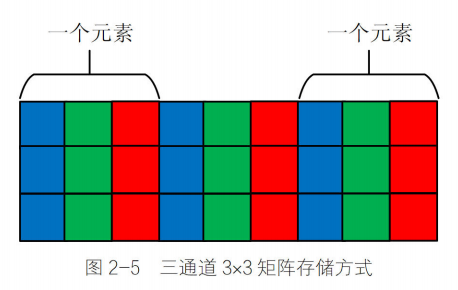

在了解了Mat类变量的存储方式之后，我们来看Mat类具有的属性。表2-2中列出了Mat类矩阵常用的属性，同时详细地介绍了每种属性的作用。

表2-2 Mat类矩阵常用的属性
| 属性         | 作用             |
| :--------- | :------------- |
| cols       | 矩阵的列数          |
| rows       | 矩阵的行数          |
| step       | 以字节为单位的矩阵的有效宽度 |
| elemSize() | 每个元素的字节数       |
| total()    | 矩阵中元素的个数       |
| channels() | 矩阵的通道数         |

这些属性之间互相组合可以得到多数Mat类矩阵的属性，例如step属性与cols属性组合，可以求出每个元素所占据的字节数，再与channels()属性结合，就可以知道每个通道的字节数，进而知道矩阵中存储的数据量的类型。下面通过一个例子具体说明每个属性的用处：用Mat(3, 4, CV_32FC3)定义一个矩阵，这时通道数channels()为3；列数cols为4；行数rows为3；矩阵中元素的个数为3×4，结果为12；每个元素的字节数为32/8×channels()，本例最后结果为12；以字节为单位的有效长度step为elemSize()×cols，本例结果为48。

常用的Mat类矩阵的元素读取方式包括通过at方法进行读取、通过指针ptr进行读取、通过迭代器进行读取、通过矩阵元素的地址定位方式进行读取。下面将详细介绍这4种读取方式。

*1. 通过at方法读取Mat类矩阵中的元素*

通过at方法读取矩阵元素分为针对单通道的读取方法和针对多通道的读取方法，在代码清单2-19中给出了通过at方法读取单通道矩阵元素的代码。
代码清单2-19 at方法读取Mat类单通道矩阵元素

```cpp
cv::Mat a = (cv::Mat_<uchar>(3, 3) << 1, 2, 3, 4, 5, 6, 7, 8, 9);
int value = (int)a.at<uchar>(0, 0);
```

通过at方法读取元素需要在后面跟上"<数据类型>"，如果此处的数据类型与矩阵定义时的数据类型不相同，就会出现因数据类型不匹配而产生的报错信息。该方法以坐标的形式给出需要读取的元素坐标(行数, 列数)。需要说明的是，如果矩阵定义的是uchar类型的数据，那么在需要输入数据的时候，需要强制转换成int类型的数据进行输出，否则输出的结果并不是整数。

由于单通道图像是一个二维矩阵，因此在at方法的最后给出二维平面坐标即可访问对应位置元素。而多通道矩阵每一个元素坐标处都是多个数据，因此引入一个变量用于表示同一元素的多个数据。在OpenCV中，针对三通道矩阵，定义了cv::Vec3b、cv::Vec3s、cv::Vec3w、cv::Vec3d、cv::Vec3f、cv::Vec3i共6种类型用于表示同一个元素的3个通道数据。通过这6种数据类型可以总结出其命名规则，其中的数字表示通道的个数，最后一位是数据类型的缩写，b是uchar类型的缩写、s是short类型的缩写、w是ushort类型的缩写、d是double类型的缩写、f是float类型的缩写、i是int类型的缩写。当然，OpenCV也为二通道和四通道定义了对应的变量类型，其命名方式也遵循这个命名规则，例如二通道和四通道的uchar类型分别用cv::Vec2b和cv::Vec4b表示。代码清单2-20中给出了通过at方法读取多通道矩阵的实现代码。

代码清单2-20 at方法读取Mat类多通道矩阵元素

```cpp
cv::Mat b(3, 4, CV_8UC3, cv::Scalar(0, 0, 1));
cv::Vec3b vc3 = b.at<cv::Vec3b>(0, 0);
int first = (int)vc3.val[0];
int second = (int)vc3.val[1];
int third = (int)vc3.val[2];
```

在使用多通道变量类型时，同样需要注意at方法中数据变量类型与矩阵的数据变量类型相对应，并且cv::Vec3b类型在输入每个通道数据时需要将其变量类型强制转换成int类型。不过，如果将at方法读取出的数据直接赋值给cv::Vec3i类型变量，就不需要在输出每个通道数据时进行数据类型的强制转换。

*2. 通过指针ptr读取Mat类矩阵中的元素*

前面我们分析过Mat类矩阵在内存中的存放方式，矩阵中每一行中的每个元素都是挨着存放的，如果找到每一行元素的起始地址位置，那么读取矩阵中每一行不同位置的元素时将指针在起始位置向后移动若干位即可。在代码清单2-21中，给出了通过指针ptr读取Mat类矩阵元素的代码实现。
代码清单2-21 指针ptr读取Mat类矩阵元素

```cpp
cv::Mat b(3, 4, CV_8UC3, cv::Scalar(0, 0, 1));
for (int i = 0; i < b.rows; i++)
{
    uchar* ptr = b.ptr<uchar>(i);
    for (int j = 0; j < b.cols * b.channels(); j++)
    {
        cout << (int)ptr[j] << endl;
    }
}
```

在程序里，首先有一个大循环用来控制矩阵中每一行，之后定义一个uchar类型的指针ptr，在定义时需要声明Mat类矩阵的变量类型，并在定义最后用小括号声明指针指向Mat类矩阵的哪一行。第二个循环控制用于输出矩阵中每一行所有通道的数据。根据图2-5中所示的存储形式，每一行中存储的数据数量为列数与通道数的乘积，即指针可以向后移动cols×channels()位，如第7行代码所示，指针向后移动的位数在中括号给出。程序中给出了循环遍历Mat类矩阵中的每一个数据的方法，当我们能够确定需要访问的数据时，可以直接通过给出行数和指针后移的位数进行访问，例如，当读取第2行数据中第3个数据时，可以直接通过ptr[2]访问。

*3. 通过迭代器访问Mat类矩阵中的元素*

Mat类变量同时也是一个容器变量，因此，Mat类变量拥有迭代器，用于访问Mat类变量中的数据，通过迭代器可以实现对矩阵中每一个元素的遍历，代码实现在代码清单2-22中给出。
代码清单2-22 通过迭代器读取Mat类矩阵元素

```cpp
cv::MatIterator_<uchar> it = a.begin<uchar>();
cv::MatIterator_<uchar> it_end = a.end<uchar>();
for (int i = 0; it != it_end; it++)
{
    cout << (int)(*it) << " ";
    if ((++i % a.cols) == 0)
    {
        cout << endl;
    }
}
```

Mat类的迭代器变量类型是cv::MatIterator_<>，在定义时同样需要在尖括号中声明数据的变量类型。Mat类迭代器的起始是Mat.begin<>()，结束是Mat.end<>()，与其他迭代器用法相同，通过"++"运算实现指针位置向下迭代，数据的读取方式是先读取第一个元素的每一个通道，之后再读取第二个元素的每一个通道，直到最后一个元素的最后一个通道。

*4. 通过矩阵元素的地址定位方式访问元素*

前面3种读取元素的方式都需要知道Mat类矩阵存储数据的类型，而且在认知上，我们更希望能够通过声明"第X行第X列第X通道"的方式来读取某个通道内的数据，代码清单2-23中给出的就是这种读取数据的方式。

代码清单2-23 通过矩阵元素的地址定位方式访问元素

```cpp
(int)(*(b.data + b.step[0] * row + b.step[1] * col + channel));
```

代码中row变量的含义是某个数据所在元素的行数，col变量的含义是某个数据所在元素的列数，channel变量的含义是某个数据所在元素的通道数。这种方式与我们通过指针读取数据的形式类似，都是通过将首个数据的地址指针移动若干位后指向需要读取的数据，只不过这种方式可以通过直接给出行、列和通道数进行读取，不需要用户再计算某个数据在这行数据存储空间中的位置。

### 图像的读取与显示

本节中将详细介绍图像读取和显示的相关功能。

#### 图像读取函数imread

我们在前面已经介绍过了图像读取函数imread()的调用方式（见代码清单1-1），这里我们给出函数的原型（见代码清单2-24）。
代码清单2-24 imread()函数的原型

```cpp
cv::Mat cv::imread(const String &filename,
                   int flags = IMREAD_COLOR);
```
- filename: 需要读取图像的文件名称，包含图像地址、名称和图像文件扩展名。
- flags: 读取图像形式的标志，如将彩色图像按照灰度图读取，默认参数是按照彩色图像格式读取，可选参数在表2-3中给出。

函数用于读取指定的图像并将其返回给一个Mat类变量，当图像文件不存在、破损或者格式不受支持时，则无法读取图像，此时函数返回一个空矩阵，因此可以通过返回矩阵的data属性是否为空或者empty()函数是否为真来判断是否成功读取图像，如果读取图像失败，那么data属性返回值为0，empty()函数返回值为1。

函数能够读取多种格式的图像文件，但是，在不同操作系统中，由于使用的编解码器不同，因此在某个系统中能够读取的图像文件可能在其他系统中就无法读取。无论在哪个系统中，BMP文件和DIB文件都是始终可以读取的。在Windows和macOS系统中，默认情况下使用OpenCV自带的编解码器(libjpeg、libpng、libtiff和libjasper)，因此可以读取JPEG (jpg、jpeg、jpe)、PNG、TIFF (tiff、tif)文件，在Linux系统中，需要自行安装这些编解码器，安装后同样可以读取这些类型的文件。

不过需要说明的是，该函数能否读取文件数据与扩展名无关，而是通过文件的内容确定图像的类型，例如，在将一个扩展名由png修改成exe时，该函数一样可以读取该图像，但是将扩展名exe改成png，该函数不能加载该文件。
该函数第一个参数以字符串形式给出待读取图像的地址，第二个参数是设置读取图像的形式，默认的参数是以彩色图的形式读取，针对不同需求可以更改参数，在OpenCV 4.1中给出了13种模式读取图像的形式，总结起来分别是以原样式读取、灰度图读取、彩色图读取、多位数读取、在读取时将图像缩小一定尺寸等形式，具体可选择的参数及作用见表2-3。这里需要指出的是，将彩色图像转成灰度图通过编解码器内部转换，可能会与OpenCV程序中将彩色图像转成灰度图的结果存在差异。这些标志参数在功能不冲突的前提下可以同时声明多个，不同参数之间用"|"隔开。

表2-3 imread()函数读取图像形式参数
| 标志参数                          | 简记  | 作用                                                           |
| :---------------------------- | :-- | :----------------------------------------------------------- |
| IMREAD\_UNCHANGED             | -1  | 按照图像原样读取，保留Alpha通道（第4通道）                                     |
| IMREAD\_GRAYSCALE             | 0   | 将图像转成单通道灰度图像后读取                                              |
| IMREAD\_COLOR                 | 1   | 将图像转换成3通道BGR彩色图像                                             |
| IMREAD\_ANYDEPTH              | 2   | 保留原图像的16位、32位深度，不声明该参数则转成8位读取                                |
| IMREAD\_ANYCOLOR              | 4   | 以任何可能的颜色读取图像                                                 |
| IMREAD\_LOAD\_GDAL            | 8   | 使用gdal驱动程序加载图像                                               |
| IMREAD\_REDUCED\_GRAYSCALE\_2 | 16  | 将图像转成单通道灰度图像，尺寸缩小1/2。可以更改最后一位数字实现缩小1/4（最后一位改为4）和1/8（最后一位改为8） |
| IMREAD\_REDUCED\_COLOR\_2     | 17  | 将图像转成3通道彩色图像，尺寸缩小1/2。可以更改最后一位数字实现缩小1/4（最后一位改为4）和1/8（最后一位改为8） |
| IMREAD\_IGNORE\_ORIENTATION   | 128 | 不以EXIF的方向旋转图像                                                |

注意：在默认情况下，读取图像的像素数目必须小于2³⁰，这个要求在绝大多数图像处理领域是不受影响的，但是卫星遥感图像、超高分辨率图像的像素数目可能会超过这个阈值。可以通过修改系统变量中的OPENCV_IO_MAX_IMAGE_PIXELS参数调整能够读取的最大像素数目。

#### 图像窗口函数namedWindow

在我们之前的程序中并没有介绍过窗口函数，因为在显示图像时如果没有主动定义图像窗口，程序会自动生成一个窗口用于显示图像，然而有时需要在显示图像之前对图像窗口进行操作，例如添加滑动条，此时就需要提前创建图像窗口。代码清单2-25中给出了创建窗口函数的原型。
代码清单2-25 namedWindow()函数的原型

```cpp
void cv::namedWindow(const String &winname,
                     int flags = WINDOW_AUTOSIZE);
```

- winname: 窗口名称，用作窗口的标识符。
- flags: 窗口属性设置标志。

该函数会创建一个窗口变量，用于显示图像和滑动条，通过窗口的名称引用该窗口，如果在创建窗口时已经存在具有相同名称的窗口，则该函数不会执行任何操作。创建一个窗口需要占用部分内存资源，因此，通过该函数创建窗口后，在不需要窗口时需要关闭窗口来释放内存资源。OpenCV提供了两个关闭窗口资源的函数，分别是cv::destroyWindow()函数和cv::destroyAllWindows()。通过名称我们可以知道，前一个函数是用于关闭一个指定名称的窗口，即在括号内输入窗口名称的字符串即可将对应窗口关闭；后一个函数是关闭程序中所有的窗口，一般用于程序的最后。

不过事实上，在一个简单的程序里，我们并不需要调用这些函数，因为程序退出时会自动关闭应用程序的所有资源和窗口。虽然不主动释放窗口也会在程序结束时释放窗口资源，但是OpenCV 4.0版在结束时会报出没有释放窗口的错误，而OpenCV 4.1版则不会报错。

该函数的第一个参数是声明窗口的名称，用于窗口的唯一识别。第二个参数是声明窗口的属性，主要用于设置窗口的大小是否可调、显示的图像是否填充满窗口等，具体可选择的参数及含义在表2-4中给出，默认情况下，函数加载的标志参数为WINDOW_AUTOSIZE | WINDOW_KEEPRATIO | WINDOW_GUI_EXPANDED。

表2-4 namedWindow()函数窗口属性标志参数
| 标志参数                  | 简记         | 作用                   |
| :-------------------- | :--------- | :------------------- |
| WINDOW\_NORMAL        | 0x00000000 | 显示图像后，允许用户随意调整窗口大小   |
| WINDOW\_AUTOSIZE      | 0x00000001 | 根据图像大小显示窗口，不允许用户调整大小 |
| WINDOW\_OPENGL        | 0x00001000 | 创建窗口的时候会支持OpenGL     |
| WINDOW\_FULLSCREEN    | 1          | 全屏显示窗口               |
| WINDOW\_FREERATIO     | 0x00000100 | 调整图像尺寸以充满窗口          |
| WINDOW\_KEEPRATIO     | 0x00000000 | 保持图像的比例              |
| WINDOW\_GUI\_EXPANDED | 0x00000000 | 创建的窗口允许添加工具栏和状态栏     |
| WINDOW\_GUI\_NORMAL   | 0x00000010 | 创建没有状态栏和工具栏的窗口       |

#### 图像显示函数imshow

我们在前面已经介绍过了图像显示函数imshow()的调用方式，这里我们给出函数的原型（见代码清单2-26）。
代码清单2-26 imshow()函数的原型

```cpp
void cv::imshow(const String &winname,
                InputArray mat);
```

- winname: 要显示图像的窗口的名字，用字符串形式赋值。
- mat: 要显示的图像矩阵。

该函数会在指定的窗口中显示图像。如果在此函数之前没有创建同名的图像窗口，就会以WINDOW_AUTOSIZE标志创建一个窗口，显示图像的原始大小；如果创建了图像窗口，那么会缩放图像以适应窗口属性。该函数会根据图像的深度将其缩放，具体缩放规则如下：

- 如果图像是8位无符号类型，那么按照原样显示。
- 如果图像是16位无符号类型或者32位整数类型，那么会将像素除以256，将范围由[0,255×256]映射到[0,255]。
- 如果图像是32位或64位浮点类型，那么将像素乘以255，即将范围由[0,1]映射到[0,255]。

函数中第一个参数为图像显示窗口的名称，第二个参数是需要显示的图像Mat类矩阵。这里需要特殊说明的是，我们看到第二个参数并不是常见的Mat类，而是InputArray，这个是OpenCV定义的一个类型声明引用，用作输入参数的标识，我们在遇到它时可以认为是需要输入一个Mat类数据。同样，OpenCV对输出也定义了OutputArray类型，我们同样可以认为是输出一个Mat类数据。

此函数运行后会继续执行后面程序。如果后面程序执行完直接退出，那么显示的图像有可能闪一下就消失，因此在需要显示图像的程序中，往往会在imshow()函数后跟有cv::waitKey()函数，用于将程序暂停一段时间。waitKey()函数是以毫秒计的等待时长，如果参数默认或者为"0"，那么表示等待用户按键结束该函数。


显示一张图片的代码：

```cpp
#include "chapter2_2_show_image/inc/show_image.hpp"
#include <iostream>
#include <opencv2/opencv.hpp>


void opencv_function1(void)
{
    cv::Mat picture_demo_mat = cv::imread(std::string(MEDIA_PATH) + "林星阑L.jpg");
    cv::imshow("xiaoshen", picture_demo_mat);

    std::cout << "成功运行OpenCV!" << std::endl; 

    cv::waitKey(0);   			// 这句确保窗口一直打开
}
```


显示一张图片的代码（使用英伟达显卡CUDA加速）：

```cpp
#include "chapter2_2_show_image/inc/show_image_CUDA.hpp"
#include <iostream>
#include <opencv2/opencv.hpp>

void opencv_function2(void)
{
    cv::Mat picture_demo_mat = cv::imread(std::string(MEDIA_PATH) + "林星阑H.jpg");
    cv::cuda::GpuMat gpuImage; 
    gpuImage.upload(picture_demo_mat); 
    cv::Mat result; 
    gpuImage.download(result);
    cv::namedWindow("林星阑",cv::WINDOW_NORMAL);
    cv::imshow("林星阑", result);
    std::cout << "CUDA成功运行!" << std::endl;
    cv::waitKey(0);   			// 这句确保窗口一直打开

}
```


### 视频加载与摄像头调用

前面已经介绍了如何通过程序读取图像数据，本节将介绍OpenCV中为读取视频文件和调用摄像头而设计的VideoCapture类。

#### 视频数据的读取

虽然视频文件是由多张图片组成的，但imread()函数并不能直接读取视频文件，需要由专门的视频读取函数进行视频读取，并将每一帧图像保存到Mat类矩阵中。代码清单2-27中给出了VideoCapture类在读取视频文件时的构造方式。
代码清单2-27 读取视频文件VideoCapture类构造函数

```cpp
cv::VideoCapture::VideoCapture();  // 默认构造函数

cv::VideoCapture::VideoCapture(const String& filename,
                               int apiPreference = CAP_ANY);
```

- filename: 读取的视频文件或者图像序列名称。
- apiPreference: 读取数据时设置的属性，例如编码格式、是否调用OpenNI等。

该函数是构造一个能够读取与处理视频文件的视频流。代码清单2-27中的第一行是VideoCapture类的默认构造函数，只是声明了一个能够读取视频数据的类，具体读取什么视频文件，需要在使用时通过open()函数指出，例如cap.open("1.avi")是VideoCapture类变量cap读取1.avi视频文件。

第二种构造函数在给出声明变量的同时也将视频数据赋值给变量。可以读取的文件种类包括视频文件（例如video.avi）、图像序列或者视频流的URL。其中读取图像序列需要将多个图像的名称统一为"前缀+数字"的形式，通过"前缀+%02d"的形式调用，例如，在某个文件夹中有图片img_00.jpg、img_01.jpg、img_02.jpg加载时，文件名用img_%02d.jpg表示。函数中的读取视频设置属性标签默认的是自动搜索合适的标志，因此，在平时使用中，可以将其默认，只输入视频名称。与imread()函数一样，构造函数同样有可能读取文件失败，因此需要通过isOpened()函数进行判断。如果读取成功，则返回值为true；如果读取失败，则返回值为false。
通过构造函数只是将视频文件加载到了VideoCapture类变量中，当我们需要使用视频中的图像时，还需要将图像由VideoCapture类变量里导出到Mat类变量里，用于后期数据处理，该操作可以通过">>"运算符将图像按照视频顺序由VideoCapture类变量赋值给Mat类变量。当VideoCapture类变量中所有的图像都赋值给Mat类变量后，再次赋值的时候Mat类变量会变为空矩阵，因此可以通过empty()判断VideoCapture类变量中是否所有图像都已经读取完毕。

VideoCapture类变量同时提供了可以查看视频属性的get()函数，通过输入指定的标志来获取视频属性，例如视频的像素尺寸、帧数、帧率等。VideoCapture类中get()方法中的常用标志和含义在表2-5中给出。

表2-5 VideoCapture类中get()方法中的标志参数
| 标志参数                     | 简记 | 作用                |
| :----------------------- | :- | :---------------- |
| CAP\_PROP\_POS\_MSEC     | 0  | 视频文件的当前位置（以毫秒为单位） |
| CAP\_PROP\_FRAME\_WIDTH  | 3  | 视频流中图像的宽度         |
| CAP\_PROP\_FRAME\_HEIGHT | 4  | 视频流中图像的高度         |
| CAP\_PROP\_FPS           | 5  | 视频流中图像的帧率（每秒帧数）   |
| CAP\_PROP\_FOURCC        | 6  | 编解码器的4字符代码        |
| CAP\_PROP\_FRAME\_COUNT  | 7  | 视频流中图像的帧数         |
| CAP\_PROP\_FORMAT        | 8  | 返回的Mat对象的格式       |
| CAP\_PROP\_BRIGHTNESS    | 10 | 图像的亮度（仅适用于支持的相机）  |
| CAP\_PROP\_CONTRAST      | 11 | 图像对比度（仅适用于相机）     |
| CAP\_PROP\_SATURATION    | 12 | 图像饱和度（仅适用于相机）     |
| CAP\_PROP\_HUE           | 13 | 图像的色调（仅适用于相机）     |
| CAP\_PROP\_GAIN          | 14 | 图像的增益（仅适用于支持的相机）  |

为了更加熟悉VideoCapture类，在代码清单2-28中给出了读取视频、输出视频属性并按照原帧率显示视频的程序，运行结果在图2-6中给出。

代码清单2-28 VideoCapture.cpp 读取视频文件

```cpp
#include "chapter2_3_video_capture/inc/read_video.hpp"
#include <cstdio>
#include <opencv2/opencv.hpp>


int opencv_function3(void)
{
    cv::VideoCapture video__(std::string(MEDIA_PATH) + "hei.mp4");
    if(video__.isOpened() == true)  //判断视频是否导入成功
    {
        printf("视频中图像的宽度=%lf",video__.get(cv::CAP_PROP_FRAME_WIDTH));
        printf("视频中图像的高度=%lf",video__.get(cv::CAP_PROP_FRAME_HEIGHT));
        printf("视频的帧率=%lf",video__.get(cv::CAP_PROP_FPS));
        printf("视频的总帧数=%lf",video__.get(cv::CAP_PROP_FRAME_COUNT));
    }
    else
    {
        printf("导入视频失败，请确认视频文件是否正确");
        return 1;
    }

    while(true)
    {
        cv::Mat frame__;
        video__ >> frame__;
        if(frame__.empty() == true) //检测图像是不是空的，如果是空的，说明视频最后一帧也已经导入完了
        {
        break;
        }
        cv::imshow("视频播放",frame__);
        cv::waitKey(1000 / video__.get(cv::CAP_PROP_FPS));   //FPS为1秒每帧（也就是帧的数量），用1000ms / 帧的数量 = 每帧所需时间
    }
    cv::waitKey(0);   			// 这句确保窗口视频播放完后一直打开，不关闭
}
```


图2-6 读取视频程序运行结果


#### 摄像头的直接调用

VideoCapture类还可以调用摄像头，构造方式如代码清单2-29所示。

代码清单2-29 VideoCapture类调用摄像头构造函数

```cpp
cv::VideoCapture::VideoCapture(int index,
                               int apiPreference = CAP_ANY);
```

通过与代码清单2-27对比，调用摄像头与读取视频文件相比，只有第一个参数不同。调用摄像头时，第一个参数为要打开的摄像头设备的ID，ID的命名方式从0开始。从摄像头中读取图像数据的方式与从视频中读取图像数据的方式相同，通过">>"符号读取当前时刻相机拍摄到的图像。并且，在读取视频时，VideoCapture类具有的属性同样可以使用。我们将代码清单2-28中的视频文件改成摄像头ID(0)，再次运行修改后的代码清单2-28中的程序，运行结果如图2-7所示。

Linux查询摄像头ID：
```bash
ls /dev/video*
```

然后输出

```bash
/dev/video0  /dev/video1  /dev/video2  /dev/video3
```

这里的4个摄像头设备不一定都是真摄像头，在我这边，0是笔记本自带的摄像头，而2是我外接的USB摄像头，都试一下就可以了。

图2-7 调用摄像头程序运行结果
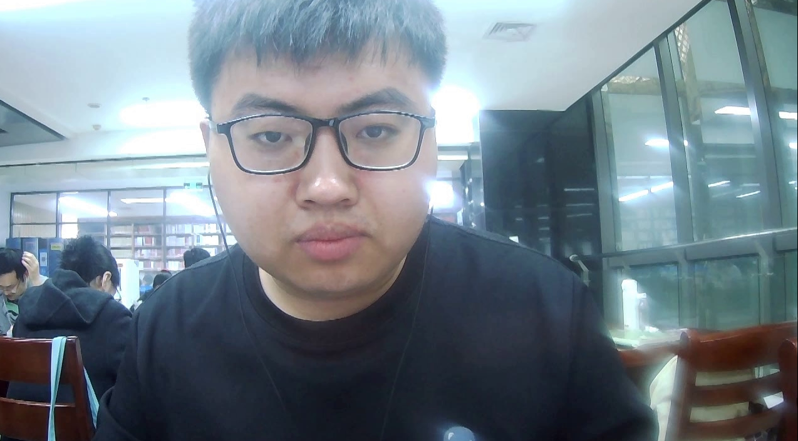

### 数据保存
在图像处理过程中，会生成新的图像，例如将模糊的图像经过算法变得更加清晰，将彩色图像变成灰度图像，同时需要将处理的结果以图像或者视频的形式保存成文件。本节将详细讲述如何将Mat类矩阵保存成图像或者视频文件。

#### 图像的保存

OpenCV提供imwrite()函数用于将Mat类矩阵保存成图像文件，该函数的原型在代码清单2-30中给出。

代码清单2-30 imwrite()函数原型

```cpp
bool cv::imwrite(const String& filename,
                 InputArray img,
                 const std::vector<int>& params = std::vector<int>());
```

- filename: 保存图像的地址和文件名，包含图像格式。
- img: 将要保存的Mat类矩阵变量。
- params: 保存图片格式属性设置标志。
该函数用于将Mat类矩阵保存成图像文件，如果成功保存，则返回true，否则返回false。可以保存的图像格式参考imread()函数能够读取的图像文件格式，通常使用该函数只能保存8位单通道图像和3通道BGR彩色图像，但是可以通过更改第三个参数保存成不同格式的图像。不同图像格式能够保存的图像位数如下：
- 16位无符号(CV_16U)图像可以保存成PNG、JPEG、TIFF格式文件；
- 32位浮点(CV_32F)图像可以保存成PFM、TIFF、OpenEXR和Radiance HDR格式文件；
- 4通道(Alpha通道)图像可以保存成PNG格式文件。
该函数第三个参数在一般情况下不需要填写，保存成指定的文件格式只需要直接在第一个参数后面更改文件后缀，但是当需要保存的Mat类矩阵中数据比较特殊时（如16位深度数据），则需要设置第三个参数。第三个参数的设置方式如代码清单2-31所示，常见的可选择设置标志在表2-6中给出。

代码清单2-31 imwrite()函数中第三个参数设置方式
```cpp
vector<int> compression_params;
compression_params.push_back(IMWRITE_PNG_COMPRESSION);
compression_params.push_back(9);
imwrite(filename, img, compression_params);
```
表2-6 imwrite()函数第三个参数可选择的标志及作用
| 标志参数                           | 简记  | 作用                                                  |
| :----------------------------- | :-- | :-------------------------------------------------- |
| IMWRITE\_JPEG\_QUALITY         | 1   | 保存成JPEG格式的文件的图像质量，分成0～100等级，默认95                    |
| IMWRITE\_JPEG\_PROGRESSIVE     | 2   | 增强JPEG格式，启用为1，默认值为0 (False)                         |
| IMWRITE\_JPEG\_OPTIMIZE        | 3   | 对JPEG格式进行优化，启用为1，默认参数为0 (False)                     |
| IMWRITE\_JPEG\_LUMA\_QUALITY   | 5   | JPEG格式文件单独的亮度质量等级，分成0～100，默认为0                      |
| IMWRITE\_JPEG\_CHROMA\_QUALITY | 6   | JPEG格式文件单独的色度质量等级，分成0～100，默认为0                      |
| IMWRITE\_PNG\_COMPRESSION      | 16  | 保存成PNG格式文件压缩级别，0～9，值越大意味着更小尺寸和更长的压缩时间，默认值为1（最佳速度设置） |
| IMWRITE\_TIFF\_COMPRESSION     | 259 | 保存成TIFF格式文件压缩方案                                     |


为了更好地理解imwrite()函数的使用方式，在代码清单2-32中给出了生成带有Alpha通道的矩阵，并保存成PNG格式图像的程序。程序运行后会生成一个保存了4通道的PNG格式图像，为了更直观地看到图像结果，我们在图2-8中给出了Image Watch插件中看到的图像和保存成PNG格式的图像。

代码清单2-32 imgWriter.cpp 保存图像

```cpp
#include "chapter2_4_save_media_file/inc/save_image.hpp"
#include <cstdio>
#include <opencv2/opencv.hpp>


void AlphaMat(cv::Mat *mat);

int opencv_function6(void)
{
    cv::Mat mat__(480,640,CV_8UC4);
    AlphaMat(&mat__);
    std::vector<int> compression_params;
    compression_params.push_back(cv::IMWRITE_PNG_COMPRESSION);   //PNG图像压缩标志
    compression_params.push_back(9);   //设置最高压缩质量
    if(cv::imwrite(std::string(SRCSRC_PATH) + "chapter2_4_save_media_file/save_files/save_image_test1.png",mat__,compression_params) == false)
    {
        printf("保存成PNG图像失败");
        return 1;
    }
    printf("保存成PNG图像成功");
    return 0;
}

void AlphaMat(cv::Mat *mat)
{
  CV_Assert(mat->channels() == 4);  //如果通道不等于4，那么抛出异常
  for(int i = 0;i < mat->rows;i++)   //行
  {
    for(int j = 0;j < mat->cols;j++)    //列
    {
      /*
      cv::Vec4b bgra = mat->at<cv::Vec4b>(i,j);
      bgra.val[0] = cv::saturate_cast<uint8_t>(255);    //B:255   //该函数防止溢出，里面的数只能是0-255
      bgra.val[1] = cv::saturate_cast<uint8_t>(0);      //G:0
      bgra.val[2] = cv::saturate_cast<uint8_t>(0);      //R:0
      bgra.val[3] = cv::saturate_cast<uint8_t>(180);    //α:180
      */
      cv::Vec4b &bgra = mat->at<cv::Vec4b>(i,j);
      bgra[0] = cv::saturate_cast<uint8_t>(255);     //B:255   //该函数防止溢出，里面的数只能是0-255
      bgra[1] = cv::saturate_cast<uint8_t>(0);      //G:0   //重载运算符[]
      bgra[2] = cv::saturate_cast<uint8_t>(0);      //R:0
      bgra[3] = cv::saturate_cast<uint8_t>(90);     //α:90
    }
  }
}
```

图2-8 程序中和保存后的4通道图像（左：Image Watch，右：PNG文件）
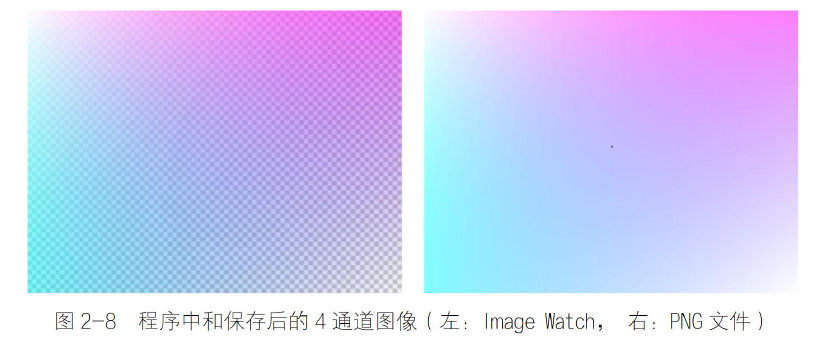

#### 视频的保存
有时我们需要将多幅图像生成视频，或者直接将摄像头拍摄到的数据保存成视频文件。OpenCV中提供了VideoWriter类用于实现多张图像保存成视频文件，该类构造函数的原型在代码清单2-33中给出。

代码清单2-33 保存视频文件VideoWriter类构造函数

```cpp
cv::VideoWriter::VideoWriter();  // 默认构造函数

cv::VideoWriter::VideoWriter(const String& filename,
                             int fourcc,
                             double fps,
                             Size frameSize,
                             bool isColor = true);
```

- filename: 保存视频的地址和文件名，包含视频格式。
- fourcc: 压缩帧的4字符编解码器代码，详细参数在表2-7中给出。
- fps: 保存视频的帧率，即视频中每秒图像的张数。
- frameSize: 视频帧的尺寸。
- isColor: 保存视频是否为彩色视频。

代码清单2-33中的第一行默认构造函数的使用方法与VideoCapture()相同，都是创建一个用于保存视频的数据流，后续通过open()函数设置保存文件名称、编解码器、帧数等一系列参数。第二种构造函数需要输入的第一个参数是需要保存的视频文件名称，第二个参数是编解码器的代码，可以设置的编解码器选项在表2-7中给出，如果赋值"-1"，则会自动搜索合适的编解码器，需要注意的是，其在OpenCV 4.0版和OpenCV 4.1版中的输入方式有一些差别，具体差别在表2-7给出。第三个参数为保存视频的帧率，可以根据需求自由设置，例如实现原视频二倍速播放、原视频慢动作播放等。第四个参数是设置保存的视频文件的尺寸，这里需要注意的是，在设置时一定要与图像的尺寸相同，不然无法保存视频。最后一个参数是设置保存的视频是否是彩色的，程序中，默认的是保存为彩色视频。

该函数与VideoCapture()有很大的相似之处，都可以通过isOpened()函数判断是否成功创建一个视频流，可以通过get()查看视频流中的各种属性。在保存视频时，我们只需要将生成视频的图像一帧一帧地通过"<<"操作符（或者write()函数）赋值给视频流，最后使用release()关闭视频流。

表2-7 视频编码格式

| OpenCV 4.1版本标志                            | OpenCV 4.0版本标志                  | 作用             |
| :---------------------------------------- | :------------------------------ | :------------- |
| `VideoWriter::fourcc('D', 'I', 'V', 'X')` | `CV_FOURCC('D', 'I', 'V', 'X')` | MPEG-4编码       |
| `VideoWriter::fourcc('P', 'I', 'M', '1')` | `CV_FOURCC('P', 'I', 'M', '1')` | MPEG-1编码       |
| `VideoWriter::fourcc('M', 'J', 'P', 'G')` | `CV_FOURCC('M', 'J', 'P', 'G')` | JPEG编码（运行效果一般） |
| `VideoWriter::fourcc('M', 'P', '4', '2')` | `CV_FOURCC('M', 'P', '4', '2')` | MPEG-4.2编码     |
| `VideoWriter::fourcc('D', 'I', 'V', '3')` | `CV_FOURCC('D', 'I', 'V', '3')` | MPEG-4.3编码     |
| `VideoWriter::fourcc('U', '2', '6', '3')` | `CV_FOURCC('U', '2', '6', '3')` | H263编码         |
| `VideoWriter::fourcc('I', '2', '6', '3')` | `CV_FOURCC('I', '2', '6', '3')` | H263I编码        |
| `VideoWriter::fourcc('F', 'L', 'V', '1')` | `CV_FOURCC('F', 'L', 'V', '1')` | FLV1编码         |

为了更好地理解VideoWriter()类的使用方式，代码清单2-34中给出了利用已有视频文件数据或者直接通过摄像头生成新的视频文件的例程。读者需要重点体会VideoWriter()类和VideoCapture()类的相似之处和使用时的注意事项。

代码清单2-34 VideoWriter.cpp 保存视频文件

```cpp
#include "chapter2_4_save_media_file/inc/save_video.hpp"
#include <cstdio>
#include <opencv2/opencv.hpp>


template <typename T>
bool Save_Video(T file_opened_name_or_index,const std::string & file_saved_name);

int opencv_function5(void)
{
    // 截取视频里的一段视频并保存到本地
    Save_Video<const std::string &>(std::string(MEDIA_PATH) + "hei.mp4",std::string(SRCSRC_PATH) + "chapter2_4_save_media_file/save_files/save_video_test1.mp4");

    // 截取摄像头里的一段视频并保存到本地
    // Save_Video<int>(2,std::string(SRCSRC_PATH) + "chapter2_4_save_media_file/save_files/save_video_test2.mp4");
    
    return 0;
}


template <typename T>
bool Save_Video(T file_opened_name_or_index,const std::string & file_saved_name)
{
    cv::Mat img;
    cv::VideoCapture video(file_opened_name_or_index);
    if(video.isOpened() == true)
    {
        printf("调用摄像头或打开视频成功!");
        printf("视频中图像的宽度=%lf",video.get(cv::CAP_PROP_FRAME_WIDTH));
        printf("视频中图像的高度=%lf",video.get(cv::CAP_PROP_FRAME_HEIGHT));
        printf("视频的帧率=%lf",video.get(cv::CAP_PROP_FPS));
        printf("视频的总帧数=%lf",video.get(cv::CAP_PROP_FRAME_COUNT));
    }
    else
    {
        printf("调用摄像头或者视频失败，请检查摄像头是否连接成功或者视频文件是否存在");
        return false;
    }
    video >> img;
    if(img.empty() == true)
    {
        printf("帧图像获取失败!");
        return false;
    }
    cv::VideoWriter writer;
    auto file_name = file_saved_name;
    int codec = writer.fourcc('M','J','P','G');
    double fps = 30.0;
    auto size = img.size();
    bool isColor = (img.type() == CV_8UC3);
    writer.open(file_name,codec,fps,size,isColor);

    if(writer.isOpened() == true)  //判断视频流是否创建成功!
    {
        printf("视频流创建成功!");
    }
    else
    {
        printf("视频流创建失败，请确认是否为合法输入!");
        return false;
    }

    while(true)
    {
        if(video.read(img) == false)   //判断是否还能够继续从摄像头或者视频中读出一帧图像
        {
            printf("摄像头断开连接或者视频读取完成!");
            break;
        }
        writer << img;  //writer.write(img);
        cv::namedWindow("Live");
        cv::imshow("Live",img);
        int8_t keyborad_value = cv::waitKey(1000 / video.get(cv::CAP_PROP_FPS));   //FPS为1秒每帧（也就是帧的数量），用1000ms / 帧的数量 = 每帧所需时间
        if(keyborad_value == 27)  //ESC键的ASCII码值为27，按下ESC键退出循环
        {
            break;
        }
    }
    video.release();
    writer.release();
    return true;
}
```

从视频中保存图片：
```cpp
#include "chapter2_4_save_media_file/inc/save_image_in_video.hpp"
#include <cstdio>
#include <opencv2/opencv.hpp>


int opencv_function7(void)
{
    cv::VideoCapture video__(0);
    cv::Mat frame__;
    if(video__.isOpened() == true)  //判断视频是否导入成功
    {
        printf("视频中图像的宽度=%lf",video__.get(cv::CAP_PROP_FRAME_WIDTH));
        printf("视频中图像的高度=%lf",video__.get(cv::CAP_PROP_FRAME_HEIGHT));
        printf("视频的帧率=%lf",video__.get(cv::CAP_PROP_FPS));
        printf("视频的总帧数=%lf",video__.get(cv::CAP_PROP_FRAME_COUNT));
    }
    else
    {
        printf("导入摄像头视频失败，请确认摄像头是否正常打开");
        return 1;
    }
    printf("按下空格键截图!");
    printf("按下ESC结束播放!");
    while(true)
    {
        video__ >> frame__;
        cv::imshow("Live",frame__);
        int32_t key_boards_val = cv::waitKey(1000/video__.get(cv::CAP_PROP_FPS));
        if(key_boards_val==32)   //检测到按下了空格键
        {
            if(cv::imwrite(std::string(SRCSRC_PATH) + "chapter2_4_save_media_file/save_files/save_image_test2.png",frame__) == false)
            {
                printf("截图失败!");
            }
            else
            {
                printf("截图成功!");
            }
            if(frame__.empty() == true) //检测图像是不是空的，如果是空的，说明视频最后一帧也已经导入完了
            {
                printf("视频播放结束,请选择截图或是按ESC退出!");
            }
        }
        else if(key_boards_val==27)   //检测到按下了ESC按键
        {
            break;
        }
    }
    video__.release();
    printf("播放被终止或已结束!");

    return 0;
}
```

#### 保存和读取XML和YAML文件

除图像数据之外，有时程序中的尺寸较小的Mat类矩阵、字符串、数组等数据也需要进行保存，这些数据通常保存成XML文件或者YAML文件。本小节中将介绍如何利用OpenCV 4中的函数将数据保存成XML文件或者YAML文件，以及如何读取这两种文件中的数据。
XML是一种元标记语言。所谓元标记，就是使用者可以根据自身需求定义自己的标记，例如可以用`<age>`、`<color>`等标记来定义数据的含义，如用`<age>24</age>`来表示age数据的数值为24。XML是一种结构化的语言，通过XML语言可以知道数据之间的隶属关系，例如`<color><red>100</red><blue>150</blue></color>`表示在color数据中含有两个名为red和blue的数据，两者的数值分别是100和150。通过标记的方式，无论以什么形式保存数据，只要文件满足XML格式，读取出来的数据就不会出现混淆和歧义。
YAML是一种以数据为中心的语言，通过"变量:数值"的形式来表示每个数据的数值，通过不同的缩进来表示不同数据之间的结构和隶属关系。YAML可读性高，常用来表达资料序列的格式，它参考了多种语言，包括XML、C语言、Python、Perl等。
OpenCV 4中提供了用于生成和读取XML文件和YAML文件的FileStorage类，类中定义了初始化类、写入数据和读取数据等方法。我们在使用FileStorage类时首先需要对其进行初始化，初始化可以理解为声明需要操作的文件和操作类型。OpenCV 4提供了两种初始化的方法，分别是不输入任何参数的初始化（可以理解为只定义，并未初始化），以及输入文件名称和操作类型的初始化。后一种方法初始化构造函数的原型在代码清单2-35中给出。
代码清单2-35 FileStorage()函数原型
```cpp
cv::FileStorage::FileStorage(const String &filename,
                             int flags,
                             const String &encoding = String());
```

- filename: 打开的文件名称。
- flags: 对文件进行的操作类型标志，常用参数及含义在表2-8中给出。
- encoding: 编码格式，目前不支持UTF-16 XML编码，需要使用UTF-8 XML编码。
表2-8 FileStorage()构造函数中对文件操作类型常用标志及含义

| 标志参数   | 简记 | 含义                   |
| :----- | :- | :------------------- |
| READ   | 0  | 读取文件中的数据             |
| WRITE  | 1  | 向文件中重新写入数据，会覆盖之前的数据  |
| APPEND | 2  | 向文件中继续写入数据，新数据在原数据之后 |
| MEMORY | 4  | 将数据写入或者读取到内部缓冲区      |


该函数是FileStorage类的构造函数，用于声明打开的文件名称和操作的类型。该函数第一个参数是打开的文件名称，参数是字符串类型，文件的扩展名是".xml"、".yaml"（或者".yml"）。打开的文件可以已经存在或者未存在，但是，当对文件进行读取操作时，需要是已经存在的文件。第二个参数是对文件进行的操作类型标志，例如对文件进行读取操作、写入操作等，常用参数及含义在表2-8中给出，由于该标志量在FileStorage类中，因此在使用时需要加上类名作为前缀，例如"FileStorage::WRITE"。最后一个参数是文件的编码格式，目前不支持UTF-16 XML编码，需要使用UTF-8 XML编码，通常情况下使用该参数的默认值即可。

打开文件后，可以通过FileStorage类中的isOpened()函数判断是否成功打开文件。如果成功打开文件，那么该函数返回true；如果打开文件失败，那么该函数返回false。

由于FileStorage类中默认构造函数没有任何参数，因此没有声明打开的文件和操作的类型，此时需要通过FileStorage类中的open()函数单独进行声明。该函数的原型在代码清单2-36中给出。

代码清单2-36 open()函数原型

```cpp
virtual bool cv::FileStorage::open(const String &filename,
                                    int flags,
                                    const String &encoding = String());
```

- filename: 打开的文件名称。
- flags: 对文件进行的操作类型标志，常用参数及含义在表2-8中给出。
- encoding: 编码格式，目前不支持UTF-16 XML编码，需要使用UTF-8 XML编码。
该函数解决了默认构造函数没有声明打开文件的问题，函数可以指定FileStorage类打开的文件。如果成功打开文件，则返回值为true，否则为false。该函数中所有的参数及含义与代码清单2-35中的相同，因此这里不再赘述。同样，通过该函数打开文件后仍然可以通过FileStorage类中的isOpened()函数判断是否成功打开文件。
打开文件后，类似C++中创建的数据流，可以通过"<<"操作符将数据写入文件中，或者通过">>"操作符从文件中读取数据。除此之外，还可以通过FileStorage类中的write()函数将数据写入文件中，该函数的原型在代码清单2-37中给出。
代码清单2-37 write()函数原型

```cpp
void cv::FileStorage::write(const String &name,
                            int val);
```

- name: 写入文件中的变量名称。
- val: 变量值。

该函数能够将不同数据类型的变量名称和变量值写入文件中。该函数的第一个参数是写入文件中的变量名称。第二个参数是变量值，代码清单2-37中的变量值是int类型，但是在FileStorage类中提供了write()函数的多个重载函数，分别用于实现将`double、String、Mat、vector<String>`

使用操作符向文件中写入数据时与write()函数类似，都需要声明变量名和变量值，例如变量名为"age"，变量值为"24"，可以通过file << "age" << 24来实现。如果某个变量的数据是一个数组，可以用"[]"将属于同一个变量的变量值标记出来，例如file << "age" << "[" << 24 << 25 << "]"。如果某些变量隶属于某个变量，可以用"{}"表示变量之间的隶属关系，例如file << "age" << "{" << "Xiaoming" << 24 << "Wanghua" << 25 << "}"。

读取数据时，可以通过file["x"] >> xRead读取变量名为x的变量值。但是，当某个变量中含有多个数据或者含有子变量时，就需要通过FileNode节点类型和迭代器FileNodeIterator进行读取，例如某个变量的变量值是一个数组，首先需要定义一个形如file["age"]的FileNode节点类型变量，之后通过迭代器遍历其中的数据。另一种方法可以不使用迭代器，通过在变量后边添加"[]"（地址）的形式读取数据，例如FileNode[0]表示数组变量中的第一个数据，FileNode["Xiaoming"]表示"age"变量中的"Xiaoming"变量的数据，依次向后添加"[]"（地址）实现多节点数据的读取。

为了了解如何生成和读取XML文件和YAML文件，在代码清单2-38中给出了实现文件写入和读取的示例程序。该程序中使用write()函数和"<<"操作符两种方式向文件中写入数据，使用迭代器和"[]"（地址）两种方式从文件中读取数据。数据的写入和读取方法在前面已经介绍，在代码清单2-38中需要重点了解如何通过程序实现写入与读取。该程序生成的XML文件和YAML文件中的数据在图2-9中给出，读取文件数据的结果在图2-10中给出。

代码清单2-38 myXMLandYAML.cpp 保存和读取XML和YAML文件

```cpp
#include "chapter2_4_save_media_file/inc/save_XMLandYMAL.hpp"
#include <cstdio>
#include <opencv2/opencv.hpp>

using namespace std;
using namespace cv;

int opencv_function8(void)
{
system("color F0");  //修改运行程序背景和文字颜色
	// string fileName = std::string(SRCSRC_PATH) + "chapter2_4_save_media_file/save_files/datas.xml";  //文件的名称
	string fileName = std::string(SRCSRC_PATH) + "chapter2_4_save_media_file/save_files/datas.yaml"; //文件的名称
	//以写入的模式打开文件
	cv::FileStorage fwrite(fileName, cv::FileStorage::WRITE);
	
	//存入矩阵Mat类型的数据
	Mat mat = Mat::eye(3, 3, CV_8U);
	fwrite.write("mat", mat);  //使用write()函数写入数据
	//存入浮点型数据，节点名称为x
	float x = 100;
	fwrite << "x" << x;
	//存入字符串型数据，节点名称为str
	String str = "Learn OpenCV 4";
	fwrite << "str" << str;
	//存入数组,节点名称为number_array
	fwrite << "number_array" << "[" <<4<<5<<6<< "]";
	//存入多node节点数据,主名称为multi_nodes
	fwrite << "multi_nodes" << "{" << "month" << 8 << "day" << 28 << "year"
		<< 2019 << "time" << "[" << 0 << 1 << 2 << 3 << "]" << "}";

	//关闭文件
	fwrite.release();

	//以读取的模式打开文件
	cv::FileStorage fread(fileName, cv::FileStorage::READ);
	//判断是否成功打开文件
	if (!fread.isOpened())
	{
		cout << "打开文件失败，请确认文件名称是否正确！" << endl;
		return -1;
	}

	//读取文件中的数据
	float xRead;
	fread["x"] >> xRead;  //读取浮点型数据
	cout << "x=" << xRead << endl;

	//读取字符串数据
	string strRead;
	fread["str"] >> strRead;
	cout << "str=" << strRead << endl;

	//读取含多个数据的number_array节点
	FileNode fileNode = fread["number_array"];
	cout << "number_array=[";
	//循环遍历每个数据
	for (FileNodeIterator i = fileNode.begin(); i != fileNode.end(); i++)
	{
		float a;
		*i >> a;
		cout << a<<" ";
	}
	cout << "]" << endl;

	//读取Mat类型数据
	Mat matRead;
	fread["mat="] >> matRead;
	cout << "mat=" << mat << endl;

	//读取含有多个子节点的节点数据，不使用FileNode和迭代器进行读取
	FileNode fileNode1 = fread["multi_nodes"];
	int month = (int)fileNode1["month"];
	int day = (int)fileNode1["day"];
	int year = (int)fileNode1["year"];
	cout << "multi_nodes:" << endl 
		<< "  month=" << month << "  day=" << day << "  year=" << year;
	cout << "  time=[";
	for (int i = 0; i < 4; i++)
	{
		int a = (int)fileNode1["time"][i];
		cout << a << " ";
	}
	cout << "]" << endl;
	
	//关闭文件
	fread.release();
	return 0;
}
```

图2-9 myXMLandYAML.cpp程序生成的XML文件和YAML文件
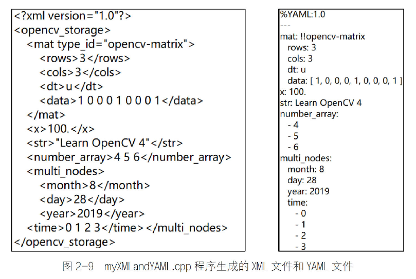

图2-10 myXMLandYAML.cpp程序文件读取结果
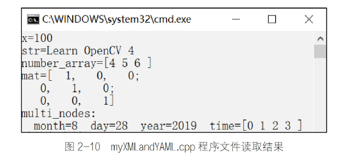


### 本章小结

在本章中，我们首先介绍了OpenCV 4中用于存放图像数据的Mat类的使用方式，之后介绍了图像的读取和显示，视频加载与摄像头的调用，最后介绍了如何保存图像、视频文件，以及XML、YAML文件的保存与读取。

本章主要函数清单

| 函数名称             | 函数说明             | 代码清单 |
| :--------------- | :--------------- | :--- |
| `imread()`       | 读取图像文件           | 2-24 |
| `namedWindow()`  | 创建一个显示图像的窗口      | 2-25 |
| `imshow()`       | 在指定窗口中显示图像       | 2-26 |
| `VideoCapture()` | 调用摄像头或者读取、保存视频文件 | 2-27 |
| `imwrite()`      | 保存图像到文件          | 2-30 |
| `VideoWriter()`  | 将多帧图像保存成视频文件     | 2-33 |
| `FileStorage()`  | 读取或者保存XML、YAML文件 | 2-35 |

## 图像基本操作

在获取图像后，首先需要了解处理图像的基本操作，例如对图像颜色的分离，像素的改变，图像的拉伸与旋转，甚至需要在图像中添加一些基础的形状，并进行简单处理。因此，本章重点介绍OpenCV 4中提供的图像基本操作，包括彩色空间的介绍、像素操作、图像形状的改变、绘制几何图形以及生成图像金字塔等。

### 图像颜色空间

通过红、绿、蓝3种颜色不同比例的混合能够让图像展现出五彩斑斓的颜色，这种模型称为RGB颜色模型。RGB颜色模型是最常见的颜色模型之一，常用于表示和显示图像。为了能够表示3种颜色的混合，图像以多通道的形式分别存储某一种颜色的红色分量、绿色分量和蓝色分量。除RGB颜色模型外，图像的颜色模型还有YUV、HSV等模型，分别表示图像的亮度、色度、饱和度等分量。了解图像颜色空间对分割拥有颜色区分特征的图像具有重要的帮助，例如提取图像中的红色物体可以通过比较图像红色通道的像素值来实现。

####  颜色模型与转换

本小节将介绍几种OpenCV 4中能够互相转换的常见颜色模型，例如RGB模型、HSV模型、Lab模型、YUV模型及GRAY模型，并介绍这几种模型之间的数学转换关系、OpenCV 4中提供的这几种模型之间的变换函数。

*1. RGB颜色模型*

前面对于RGB颜色模型已经有所介绍，该模型的命名方式是采用3种颜色的英文首字母，分别是红色(Red)、绿色(Green)和蓝色(Blue)。虽然该颜色模型的命名方式是红色在前，但是在OpenCV中却是相反的顺序，第一个通道是蓝色(B)分量，第二个通道是绿色(G)分量，第三个通道是红色(R)分量。根据存储顺序的不同，OpenCV 4中提供了这种顺序的反序格式，用于存储第一个通道是红色分量的图像，但是这两种格式图像的颜色空间是相同的，颜色空间模型如图3-1所示。3个通道对于颜色描述的范围是相同的，因此RGB颜色模型的空间构成是一个立方体。在RGB颜色模型中，所有的颜色都是由这3种颜色通过不同比例的混合得到，如果3种颜色分量都为0，则表示为黑色，如果3种颜色的分量相同且都为最大值，则表示为白色。每个通道都表示某一种颜色0～1的过程，不同位数的图像表示将这个颜色变化过程细分成不同的层级，例如8UC3格式的图像每个通道将这个过程量化成256个等级，分别由0～255表示。在这个模型的基础上增加第四个通道即为RGBA模型，第四个通道表示颜色的透明度，当没有透明度需求的时候，RGBA模型就会退化成RGB模型。

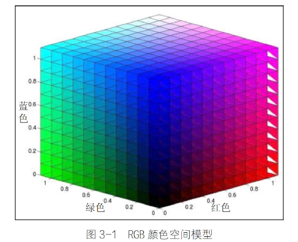

*2. YUV颜色模型*

YUV模型是电视信号系统所采用的颜色编码方式。这3个变量分别表示像素的亮度(Y)、红色分量与亮度的信号差值(U)、蓝色与亮度的差值(V)。这种颜色模型主要用于视频和图像的传输，该模型的产生与电视机的发展历程密切相关。由于彩色电视机在黑白电视机发明之后才产生，因此用于彩色电视机的视频信号需要能够兼容黑白电视机。彩色电视机需要3个通道的数据才能显示彩色，而黑白电视机只需要一个通道的数据，因此，为了使视频信号能够兼容彩色电视机与黑白电视机，将RGB编码方式转变成YUV的编码方式，其Y通道是图像的亮度，黑白电视只需要使用该通道就可以显示黑白视频图像，而彩色电视机通过将YUV编码转成RGB编码方式，便可以在彩色电视机中显示彩色图像，较好地解决了同一个视频信号兼容不同类型电视机的问题。RGB模型与YUV模型之间的转换关系如式(3-1)所示，其中RGB取值范围均为0～255。

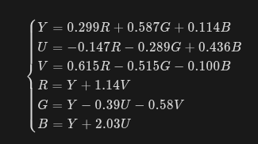

*3. HSV颜色模型*

HSV是色度(Hue)、饱和度(Saturation)和亮度(Value)的简写，通过名字也可以看出该模型通过这3个特性对颜色进行描述。色度是色彩的基本属性，就是平时常说的颜色，例如红色、蓝色等；饱和度是指颜色的纯度，饱和度越高色彩越纯和越艳，饱和度越低，色彩则逐渐地变灰和变暗，饱和度的取值范围是0～100%；亮度是颜色的明亮程度，其取值范围由0到计算机中允许的最大值。由于色度、饱和度和亮度的取值范围不同，因此其颜色空间模型用锥形表示，如图3-2所示。相比于RGB模型3个颜色分量与最终颜色联系不直观的缺点，HSV模型更加符合人类感知颜色的方式：颜色、深浅及亮暗。

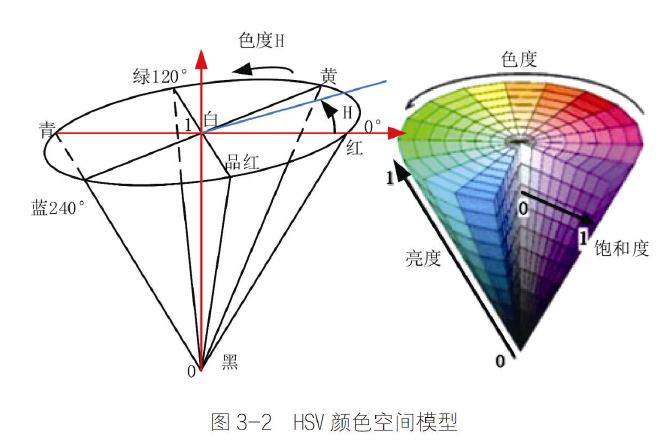

*4. Lab颜色模型*

Lab颜色模型弥补了RGB模型的不足，是一种设备无关和基于生理特征的颜色模型。在模型中，L表示亮度(Luminosity)，a和b是两个颜色通道，两者的取值区间都是-128～127，其中a通道数值由小到大对应的颜色是从绿色变成红色，b通道数值由小到大对应的颜色是由蓝色变成黄色。Lab颜色模型构成的颜色空间是一个球形，如图3-3所示。

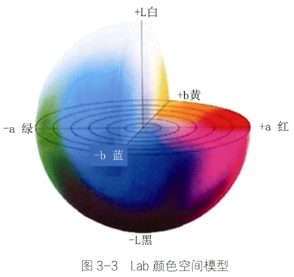

*5. GRAY颜色模型*

GRAY模型并不是一个彩色模型，而是一个灰度图像的模型，其命名使用的是英文单词gray的全字母大写。灰度图像只有单通道，灰度值根据图像位数不同由0到最大依次表示由黑到白，例如8UC1格式中，由黑到白被量化为256个等级，通过0～255表示，其中255表示白色。彩色图像具有颜色丰富、信息含量大的特性，但是灰度图在图像处理中依然具有一定的优势。例如，灰度图像具有相同尺寸相同压缩格式所占容量小、易于采集、便于传输等优点。常用的RGB模型转成灰度图的方式如式(3-2)所示。

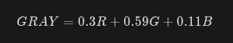

*6. 不同颜色模型间的互相转换*

针对图像不同颜色模型之间的相互转换，OpenCV 4提供了cvtColor()函数用于实现转换功能，该函数的原型在代码清单3-1中给出。

代码清单3-1 cvtColor()函数原型
```cpp
void cv::cvtColor(InputArray src,
                  OutputArray dst,
                  int code,
                  int dstCn = 0);
```

- src: 待转换颜色模型的原始图像。
- dst: 转换颜色模型后的目标图像。
- code: 颜色空间转换的标志，如由RGB空间到HSV空间。常用标志及含义在表3-1中给出。
- dstCn: 目标图像中的通道数。如果参数为0，则从src和code中自动导出通道数。

函数用于将图像从一个颜色模型转换为另一个颜色模型，前两个参数用于输入待转换图像和转换颜色空间后的目标图像，第三个参数用于声明该函数具体的转换模型空间，常用的标志在表3-1中给出，读者可以自行查阅OpenCV 4的教程以了解详细的标志。第四个参数在一般情况下不需要特殊设置，使用默认参数即可。
需要注意的是该函数变换前后的图像取值范围，由于8位无符号图像的像素为0～255，16位无符号图像的像素为0～65535，而32位浮点图像的像素为0～1，因此一定要注意目标图像的像素范围。在线性变换的情况下，范围问题不需要考虑，目标图像的像素不会超出范围。如果在非线性变换的情况下，那么应将输入RGB图像归一化到适当的范围以内来获得正确的结果，例如将8位无符号图像转成32位浮点图像，需要先将图像像素通过除以255缩放到0～1范围内，以防止产生错误结果。

注意：如果转换过程中添加了alpha通道（RGB模型中第四个通道，表示透明度），则其值将设置为相应通道范围的最大值：CV_8U为255，CV_16U为65535，CV_32F为1。

表3-1 cvtColor()函数颜色模型转换常用标志参数

| 标志参数             | 简记 | 作用               |
| :--------------- | :- | :--------------- |
| `COLOR_BGR2BGRA` | 0  | 对RGB图像添加alpha通道  |
| `COLOR_BGR2RGB`  | 4  | 彩色图像通道颜色顺序的更改    |
| `COLOR_BGR2GRAY` | 10 | 彩色图像转成灰度图像       |
| `COLOR_GRAY2BGR` | 8  | 灰度图像转成彩色图像（伪彩色）  |
| `COLOR_BGR2YUV`  | 82 | RGB颜色模型转成YUV颜色模型 |
| `COLOR_YUV2BGR`  | 84 | YUV颜色模型转成RGB颜色模型 |
| `COLOR_BGR2HSV`  | 40 | RGB颜色模型转成HSV颜色模型 |
| `COLOR_HSV2BGR`  | 54 | HSV颜色模型转成RGB颜色模型 |
| `COLOR_BGR2Lab`  | 44 | RGB颜色模型转成Lab颜色模型 |
| `COLOR_Lab2BGR`  | 56 | Lab颜色模型转成RGB颜色模型 |

为了直观地感受同一张图像在不同颜色空间中的样子，在代码清单3-2中给出了前面几种颜色模型互相转换的程序，运行结果如图3-4所示。需要说明的是，Lab颜色模型具有负数，而通过imshow()函数显示的图像无法显示负数，因此在结果中给出了利用Image Watch插件显示图像在Lab模型中的样子。在程序中，为了防止转换后出现数值越界的情况，我们先将CV_8U类型转成CV_32F类型后再进行颜色模型的转换。

代码清单3-2 myCvColor.cpp 图像颜色模型互相转换

```cpp
#include "chapter3_1_cvclolor/inc/CvColor.hpp"
#include <cstdio>
#include <opencv2/opencv.hpp>


int opencv_function9(void)
{
  const std::string & file_name = std::string(MEDIA_PATH) + "林星阑L.jpg";

  cv::Mat img = cv::imread(file_name);
  if(img.empty() == true)
  {
      std::cout << "请确认图像文件是否正确，请检查输入格式" << std::endl;
      return 1;
  }
  else
  {
      std::cout << "图像成功读取!" << std::endl;
  }
  cv::Mat img32;
  cv::Mat gray,HSV,YUV,Lab;
  img.convertTo(img32,CV_32F,1.0/255);   //缩放因子:1.0/255指将现在的图像的范围转换为目标图像的范围需要乘以的因数
  cv::cvtColor(img32,HSV,cv::COLOR_BGR2HSV);
  cv::cvtColor(img32,YUV,cv::COLOR_BGR2YUV);
  cv::cvtColor(img32,Lab,cv::COLOR_BGR2Lab);
  cv::cvtColor(img32,gray,cv::COLOR_BGR2GRAY);

  cv::namedWindow("原图BGR",cv::WINDOW_FREERATIO);
  cv::namedWindow("HSV",cv::WINDOW_FREERATIO);
  cv::namedWindow("YUV",cv::WINDOW_FREERATIO);
  cv::namedWindow("Lab",cv::WINDOW_FREERATIO);
  cv::namedWindow("gray",cv::WINDOW_FREERATIO);
  cv::imshow("原图BGR",img32);
  cv::imshow("HSV",HSV);
  cv::imshow("YUV",YUV);
  cv::imshow("Lab",Lab);
  cv::imshow("gray",gray);
  cv::waitKey(0);

  return 0;
}

```

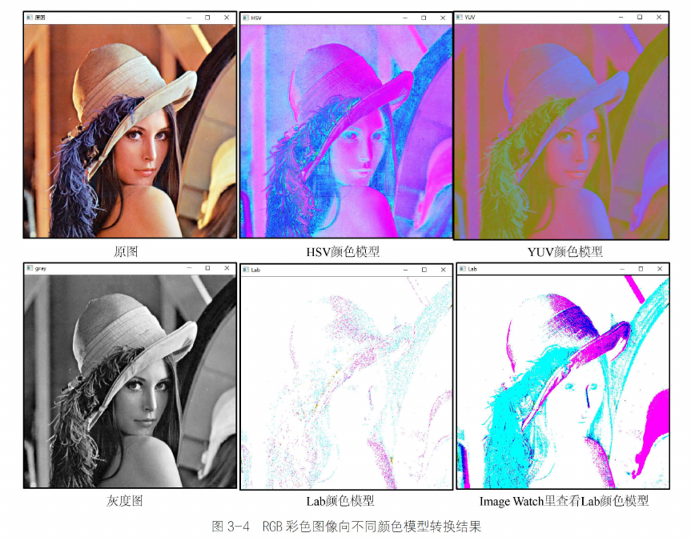

程序中我们利用了OpenCV 4中Mat类自带的数据类型转换函数convertTo()，在平时使用图像数据时也会经常遇到不同数据类型转换的问题，因此下面详细介绍该转换函数的使用方式，在代码清单3-3中给出了该函数的原型。

代码清单3-3 convertTo()函数原型

```cpp
void cv::Mat::convertTo(OutputArray m,
                        int rtype,
                        double alpha = 1,
                        double beta = 0);
```

- m: 转换类型后输出的图像。
- rtype: 转换图像的数据类型。
- alpha: 转换过程中的缩放因子。
- beta: 转换过程中的偏置因子。

该函数用来实现将已有图像转换成指定数据类型的图像，第一个参数用于输出转换数据类型后的图像，第二个参数用于声明转换后图像的数据类型。第三个参数与第四个参数用于声明两个数据类型间的转换关系，具体转换形式如式(3-3)所示。

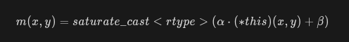

通过转换公式可以知道，该转换方式就是将原有数据进行线性转换，并按照指定的数据类型输出。根据其转换规则可以知道，该函数不但能够实现不同数据类型之间的转换，而且能够实现在同一种数据类型中的线性变换。我们在代码清单3-2中给出了CV_8U类型和CV_32F类型之间互相转换的示例，其他类型之间的互相转换与此类似，这里不再赘述，读者可以自行探索，通过实践体会该函数的使用方法。

#### 多通道分离与合并

在图像颜色模型中，不同的分量存放在不同的通道中，如果我们只需要颜色模型的某一个分量，例如只需要处理RGB图像中的红色通道，那么可以将红色通道从3个通道的数据中分离出来再进行处理，这种方式可以减少数据所占据的内存，加快程序的运行速度。同时，当我们分别处理完多个通道后，需要将所有通道合并在一起重新生成RGB图像。针对图像多通道的分离与混合，OpenCV 4中提供了split()函数和merge()函数用于满足这些需求。

*1. 多通道分离函数split()*

OpenCV 4中针对多通道分离函数split()有两种重载原型，在代码清单3-4中给出了这两种函数原型。

代码清单3-4 split()函数原型

```cpp
void cv::split(const Mat &src,
               Mat *mvbegin);

void cv::split(InputArray m,
               OutputArrayOfArrays mv);
```

- mvbegin: 分离后的单通道图像，为数组形式，数组大小需要与图像的通道数相同。
- m: 待分离的多通道图像。
- mv: 分离后的单通道图像，为向量(vector)形式。

该函数主要是用于将多通道的图像分离成若干单通道的图像，两个函数原型中不同之处在于，前者第二个参数输出的是Mat类型的数组，其数组的长度需要与多通道图像的通道数相等并且提前定义；第二种函数原型的第二个参数输出的是一个`vector<Mat>`容器，不需要知道多通道图像的通道数。虽然两个函数原型输入参数的类型不同，但通道分离的原理是相同的。

*2. 多通道合并函数merge()*

OpenCV 4中针对多通道合并函数merge()也有两种重载原型，在代码清单3-5中给出了这两种原型。
代码清单3-5 merge()函数原型

```cpp
void cv::merge(const Mat *mv,
               size_t count,
               OutputArray dst
                )

void cv::merge(InputArrayOfArrays mv,
               OutputArray dst);
```

- mv（第一种重载原型参数）：需要合并的图像数组，其中每个图像必须拥有相同的尺寸和数据类型。
- count：输入的图像数组的长度，其数值必须大于0。
- mv（第二种重载原型参数）：需要合并的图像向量(vector)，其中每个图像必须拥有相同的尺寸和数据类型。
- dst：合并后输出的图像，与mv[0]具有相同的尺寸和数据类型，通道数等于所有输入图像的通道数总和。

该函数主要用于将多个图像合并成一个多通道图像，该函数也具有两种不同的函数原型，每一种函数原型都与split()函数相对应，两种原型分别输入数组形式的图像数据和向量(vector)形式的图像数据，在输入数组形式数据的原型中，还需要输入数组的长度。合并函数的输出结果是一个多通道的图像，其通道数目是所有输入图像通道数目的总和。这里需要说明的是，用于合并的图像并非都是单通道的，也可以是多个通道数目不相同的图像合并成一个通道更多的图像。虽然这些图像的通道数目可以不相同，但是需要所有图像具有相同的尺寸和数据类型。

*3. 图像多通道分离与合并例程*

为了使读者更加熟悉图像多通道分离与合并的操作，同时加深对图像不同通道作用的理解，在代码清单3-6中实现了图像的多通道分离与合并的功能。程序中用两种函数原型分别分离了RGB图像和HSV图像，为了验证merge()函数可以合并多个通道不相同的图像，程序中分别用两种函数原型合并了多个不同通道的图像，合并后图像的通道数为5，不能通过imshow()函数显示，我们用Image Watch插件在看合并的结果。由于RGB的3个通道分离结果显示时都是灰色且相差不大，因此图3-5没有给出其分离后的结果，只是给出合并后显示为绿色的合并图像，同时给出HSV分离结果，其他结果读者可以通过自行运行程序查看。
代码清单3-6 mySplitAndMerge.cpp 实现图像分离与合并

```cpp
#include "chapter3_1_cvclolor/inc/SplitAndMerge.hpp"
#include <cstdio>
#include <opencv2/opencv.hpp>

bool Mat_Arr_Split_merge(const std::string &file_name);
bool Vector_Split_merge(const std::string &file_name);


int opencv_function10(void)
{
  Mat_Arr_Split_merge(std::string(MEDIA_PATH) + "林星阑L.jpg");
//   Vector_Split_merge(std::string(MEDIA_PATH) + "林星阑L.jpg");

  return 0;
}

bool Mat_Arr_Split_merge(const std::string &file_name)
{
  cv::Mat img = cv::imread(file_name);
  if(img.empty() == false)
  {
    printf("成功读取图片!");
  }
  else
  {
    printf("无法读取图片，请确定图片文件是否存在，输入格式是否正确!");
    return false;
  }
  cv::Mat imgs[3];
  cv::Mat result[2];
  cv::split(img,imgs);
  cv::namedWindow("RGB-B通道",cv::WINDOW_FREERATIO);
  cv::namedWindow("RGB-G通道",cv::WINDOW_FREERATIO);
  cv::namedWindow("RGB-R通道",cv::WINDOW_FREERATIO);
  cv::imshow("RGB-B通道",imgs[0]);
  cv::imshow("RGB-G通道",imgs[1]);
  cv::imshow("RGB-R通道",imgs[2]);
  imgs[2] = img;  //改变图像通道数量
  cv::merge(imgs,3,result[0]);
  // cv::namedWindow("合并图像结果0",cv::WINDOW_FREERATIO);
  // cv::imshow("合并图像结果0",result[0]);   //imshow最多显示4个通道，需要Image Watch插件
  cv::Mat zero = cv::Mat::zeros(img.rows,img.cols,CV_8UC1);  //一个通道的0矩阵
  imgs[0] = zero;
  imgs[2] = zero;
  cv::merge(imgs,3,result[1]);
  cv::namedWindow("合并图像结果1",cv::WINDOW_FREERATIO);
  cv::imshow("合并图像结果1",result[1]);   //显示合并结果
  cv::waitKey(0);
  cv::destroyAllWindows();
  return true;
}

bool Vector_Split_merge(const std::string &file_name)
{
  cv::Mat img = cv::imread(file_name);
  if(img.empty() == false)
  {
    printf("成功读取图片!");
  }
  else
  {
    printf("无法读取图片，请确定图片文件是否存在，输入格式是否正确!");
    return false;
  }
  cv::Mat HSV;
  cv::Mat result;
  cv::cvtColor(img,HSV,cv::COLOR_RGB2HSV);
  std::vector<cv::Mat> imgv;
  cv::split(HSV,imgv);
  cv::namedWindow("HSV-H通道",cv::WINDOW_FREERATIO);
  cv::namedWindow("HSV-S通道",cv::WINDOW_FREERATIO);
  cv::namedWindow("HSV-V通道",cv::WINDOW_FREERATIO);
  cv::imshow("HSV-H通道",imgv.at(0));
  cv::imshow("HSV-S通道",imgv.at(1));
  cv::imshow("HSV-V通道",imgv.at(2));
  imgv.push_back(HSV);  //将imgv中的图像通道变成不一致
  cv::merge(imgv,result);
  // cv::namedWindow("合并图像结果2",cv::WINDOW_FREERATIO);
  // cv::imshow("合并图像结果2",result);   //imshow最多显示4个通道，需要Image Watch插件
  cv::waitKey(0);
  cv::destroyAllWindows();
  return true;
}
```

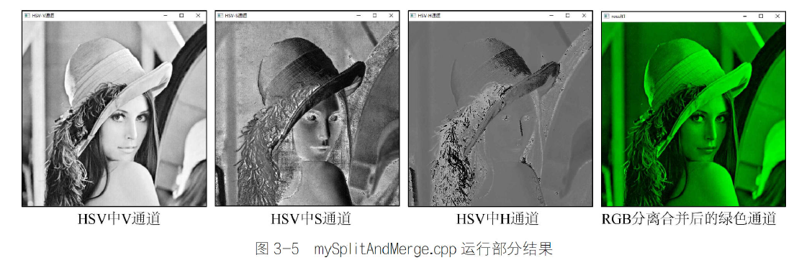

### 图像像素操作处理

在对图像的不同通道有所了解之后，接下来将对每个通道内图像像素的相关操作进行介绍。关于像素的相关概念，在前面已经有所了解，例如在CV_8U的图像中，像素取值范围由黑到白被分成了256份，灰度值为0～255来表示这个变化的过程。因此，像素灰度值的大小表示的是某个位置像素的亮暗程度，同时灰度值的变化程度也表示了图像纹理的变化程度，因此，了解像素的相关操作是了解图像内容的第一步。

#### 图像像素统计

我们可以将数字图像理解成一定尺寸的矩阵，矩阵中每个元素的大小表示了图像中每个像素的亮暗程度，因此，统计矩阵中的最大值就是寻找图像中灰度值最大的像素，计算平均值就是计算图像像素平均灰度，可以用来表示图像整体的亮暗程度。因此，针对矩阵数据的统计工作在图像像素中同样具有一定的意义和作用。在OpenCV 4中集成了求取图像像素最大值、最小值、平均值、均方差等众多用于统计的函数，下面详细介绍这些功能的相关函数。


